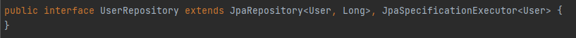

# KN.log

- 주니어 개발자의 우당탕탕 `KN` Project 회고록

- [목차](#목차) 
---
## KN Project?

옛날 옛날에 `KN` 이라는 지구 어딘가의 자동차 관련 회사가 있었음.

`Huvenet`은 해당 회사의 프로젝트를 진행하게 되었는데,

해당 프로젝트의 개요는 아래와 같음.

### 프로젝트 개요

- `KN`의 기존 렌터카 시스템(`MiPlatform`)의 고도화
    - **기존 Legacy 버그 수정, 신규 요건 개발**
- `KN` 신규 **대고객 사이트 런칭**
- 영업소 계약, 관리용도 **영업용 테블릿 사이트 런칭**
- 신규 대고객, 영업용 테블릿 서버 관리 용도 **관리자 사이트 런칭**


### 프로젝트 기간

- 개발 기간
    - 총합 : 13개월, 395일
        - 고도화 프로젝트 3.0
            - 2022.10.01 ~ 2022.02.14
        - 대고객, 영업용 테블릿, 관리자 IA 사이트 오픈
            - 2022.02.15 ~ 2022.10.03
        - 대고객, 영업용 테블릿, 관리자 IA 사이트 안정화
            - 2022.10.04 ~ 2022.10.31
    - 투입 인력 : 6 명
- 유지보수 기간
    - 총합 : 2개월, 61일
        - 2022.11.01 ~ 2022.12.31
    - 투입 인력 : 3 명
        - 2개월 2 명
        - 1개월 1 명

### 프로젝트 분량


- 화면설계서
    - 총합 : 798 P
        - 대고객 : 394P
        - 영업용 테블릿 : 176P
        - 관리자 : 122P
        - 마이플랫폼 : 106P
- 버그리포트
    - 총합 : 1,013 건
        - 개발 Ver 이슈 : 839 건
        - 운영 Ver 이슈 : 174 건
- <details><summary>산출물</summary>

  ```
  1. KN차 RFP
      - KN렌터카시스템고도화_RFP_20210802_V1.6.pptx
  2. 제안서
      - 0825_KN렌터카 고도화 프로젝트 제안서1.7_appknot.pdf
  3. 산출물 리스트
      - KN렌트카 프로젝트 산출물 목록 정리_210930_v3.xlsx
  4. 요건정의 취합(전체) ★
      - 요건 정의 취합본_210514_검토중.pptx
      - 요건 분석 정리_210802.xlsx
  5. (현)계약서 양식 ★
      - 4.28단기-자동차임대차계약서.pdf
      - 4.28장기-자동차임대차계약서.pdf
  6. KN차 렌터카사업부 담당자 업무분장표
      - ★업무분장 현황(2021.9.1일 기준)___.xlsx___.xlsx)
  7. KN차 렌터카 지점 업무처리 지침
      - 개정후)렌터카사업)1.렌터카 지점 업무처리 지침_최종.pptx렌터카사업)1.렌터카_지점_업무처리_지침_최종.pptx)
  8. 완성차 전자계약 프로세스
      - 임대차 전자계약 프로세스 (201125) .pptx_.pptx)
  9. 장기/단기 렌터카 시스템 요건정의 ★
      - (장기)계약서 렌터카시스템 요건정의 201221.pptx계약서_렌터카시스템_요건정의_201221.pptx)
      - (단기)계약서 렌터카시스템 요건정의20210118.pptx계약서_렌터카시스템_요건정의20210118.pptx)
  10. KN차 렌터카사업부 중고차 업무 ★
      - 렌터카시스템 중고차 셀 업무 21.10.05 정연석cm 作.pptx
  11. KN차 렌터카사업부 수금(채권) 업무 요건 정리 ★
      - 가상계좌 자동입금처리 개발요건정의.pptx
      - KN포인트 개발지원 요건 정의.pptx
      - 대량 거래처 관리 화면 개발요건정의.pptx
      - 세금계산서 자동전송 개발요건정의.pptx
      - 장기Table변경(SLM0050) 화면 개선요건정의.pptx_화면_개선요건정의.pptx)
  12. KN차 렌터카사업부 차량등록, 개소세 등 업무 요건 정리 ★
      - 담당자별 업무 정의(이상엽).pptx.pptx)
  13. 현대차 전자계약서 플랫폼(e-sign) 관련 자료 ★★★
      - eSign API 가이드-v1.0_210917.pdf
      - eSign 사용자 안내서_일반사용자용_v0.94_210903_ko.pdf
      - [eSign] 법인 공동 전자서명 연동 및 설계_v1.0_20211101.pptx
      - 장기-자동차임대차계약서(22.9.16)_전자계약생성용.pdf
  14. WBS 및 산출물 관리
      - KN렌터카_WBS_v0.6_211022.xlsx
      - KN렌터카_프로젝트산출물_v0.0.5_211022.xlsx
      - 기아렌터카_고도화프로젝트_테이블정의서.xls
      - Huvenet_APPVERSION_API_Reference.pdf
      - RENTA2_DDL.sql
      - KN_rent_3.0_source_admin_business_customer.zip
  15. 파일명명규칙
      - KN렌터카_명칭정의및파일명규칙_v1.0.0_211101.pdf
  16. 장기렌트 프로세스 흐름도
      - 전자결재프로세스흐름도 211103.pptx
  17. KN렌터카 관리시스템(마이플랫폼) 사용자 가이드 (참고용)
      - 신용카드관리-사용자설명서-일반사용자190411.pptx
  18. 렌터카 전자계약 연계 방안 회의록
      - 211021 전자계약서 회의록.docx
      - 2021-11-04 회의록
      - 20211104 전자게약 2차회의 현차 인원 렌터카인원 전원.docx
      - 전자결재프로세스흐름도 211103 (1).pptx.pptx)
  19. KN렌터카 고객센터 FAQ
      - KN렌터카 고객센터 상담LIST(최종).xlsx.xlsx)
  20. 블루월넛 API
      - Bluewalnut_Lite_ForJSP_빌링결제_v1.14.zip
      - KN차_렌터카시스템_연동_인터페이스명세서_V1.00_보안해제.xls
  21. KN 렌터카 시스템 IA
      - KN렌터카_IA_영업용태블릿_211108_v1.0.0.xlsx
      - KN렌터카_IA_대고객서비스_v1.3.3_220414.xlsx
  22. 인터뷰 준비_밸류랩스
      - Admin_인터뷰_준비_211109.zip
  23. 담당자별 인터뷰 시 보여준 자료 모음
      - ★ 2021 렌터카사업팀 사업계획 명의변경 프로세스 개선 (210422)_이진아매니저(11월 9일자 인터뷰).pptx_이진아매니저(11월_9일자_인터뷰).pptx)
      - 반납 프로세스Ⅲ.pptx
      - totalzip_렌터카시스템 오류 건 4번째_1635824685.703187.zip
      - totalzip_렌터카시스템 오류 건 1번째_1635824418.639206.zip
      - totalzip_렌터카시스템 오류 건 2번째_1635824493.673180.zip
      - totalzip_렌터카시스템 오류 건 3번째_1635824582.688022.zip
  24. 요구사항 ID 정의서
      - 기아렌터카_요구사항정의서_v1.4.0_211206.xlsx
  25. WBS
      - KN렌터카_WBS_v1.1.11_220214_휴비넷업데이트.xlsx
  26. 연동 API 관련 문서
      - svn_설치_가이드_리눅스용_.pdf
      - Tibero_6_Installation_Guide_v2.1.7.5.pdf
      - tibero6-bin-FS07_CS_2005-linux64-186930-opt-tested.tar.gz
      - JEUS_7_Web_Admin_Guide.pdf
      - 전자문서등록_서비스_가이드v1.0.pdf
      - PJTD_빌링결제(빌키)_연동매뉴얼_v1.14.pdf
      - eformsign 임베딩 가이드_v1.0_220808.pdf
      - eSign 전자계약 서비스 플랫폼_DASH_API설계서_v1.2_220120 (1).xlsx
      - 기아차_렌터카시스템_연동_인터페이스명세서_V1.00_보안해제 (2).xls
      - ccspApi (1).zip
      - 통합계정 API (1).pdf
      - eSign 사용자 안내서_일반사용자용_v0.94_210903_ko (1).pdf
      - eSign API 가이드-v1.0_210917 (1).pdf
      - Bluewalnut_Lite_ForJSP_빌링결제_v1.14 (1).zip
      - ATA.tar
      - tibero_package.zip
      - 가이드 문서.zip
      - fido_java_Sample.zip
  27. 대고객 화면 설계서
      - KN렌터카_화면설계서_대고객서비스_v1.1.1_220408.pptx
      - 기아렌터카_화면설계서_대고객서비스_v1.0.3_220322.pptx
      - KN렌터카_화면설계서_대고객서비스_v1.2.0_220414.pptx
      - KN렌터카_화면설계서_대고객서비스_v1.3.0_220608.pptx
      - KN렌터카_화면설계서_대고객서비스_v1.3.2_220621.pdf
      - KN렌터카_화면설계서_대고객서비스_v1.4.7_220930.pdf
  28. 관리자 웹 화면 설계서
      - KN렌터카_화면설계서_관리자웹_v1.0.6_220408.pptx
      - KN렌터카_화면설계서_관리자웹_v1.1.1_220413.pptx
      - KN렌터카_화면설계서_관리자(웹)_v1.1.4_220518.pptx_v1.1.4_220518.pptx
      - KN렌터카_화면설계서_관리자(웹)_v1.1.7_220714.pptx.pptx_v1.1.7_220714.pptx
  29. 관리자 웹 마이플랫폼 화면 설계서
      - KN렌터카_화면설계서_관리자웹_마이플랫폼_v0.0.1_220414.pptx
      - KN렌터카_화면설계서_관리자(마이플랫폼)_v0.0.2_220426.pptx_v0.0.2_220426.pptx
      - KN렌터카_화면설계서_관리자(마이플랫폼)_v0.0.4_220509.pptx_v0.0.4_220509.pptx
      - KN렌터카_화면설계서_관리자(마이플랫폼)_v0.0.6_220610.pptx_v0.0.6_220610.pptx
      - KN렌터카_화면설계서_관리자(마이플랫폼)_v0.0.9_220704.pptx_v0.0.9_220704.pptx
      - KN렌터카_화면설계서_관리자(마이플랫폼)_v0.1.2_220714.pptx.pptx_v0.1.2_220714.pptx
      - KN렌터카_화면설계서_관리자(마이플랫폼)_v0.1.3_220718.pptx_v0.1.3_220718.pptx
      - KN렌터카_화면설계서_관리자(마이플랫폼)_v0.1.4_220719.pptx_v0.1.4_220719.pptx
  30. 영업용 테블릿 화면설계서
      - KN렌터카_화면설계서_영업용태블릿_v1.1.8_220607.pptx
      - KN렌터카_화면설계서_영업용태블릿_v1.1.12_220721.pdf
      - KN렌터카_화면설계서_영업용태블릿_v1.2.9_220930.pdf
  31. 알림톡 정의서
      - KN렌터카_알림톡_v1.2.8_221017.xlsx
      - 템플릿 정의(규칙) 22.09.06.xlsx_22.09.06.xlsx
  32. CMS 자동납부 신청서 양식
      - CMS 자동납부신청서.zip
  33. 화면설계서 공통정책
      - KN렌터카_화면설계서_공통정책_v1.1.12_220831.pptx
  34. 차량 임대차 승계합의서 양식
      - 차량 임대차 승계합의서 양식.pptx
  35. 마이플랫폼 프로세스개선 화면설계서
      - 02_KN렌터카_채권외주화프로세스개선_화면설계서_v1.3_220121 (1).pptx
      - 01_KN렌터카_명의변경프로세스개선_화면설계서_v1.6_220216.pptx
  36. 프로세스 정의서
      - KN렌터카_프로세스정의서_v1.1.6_220415.pptx
  37. 제플린 디자인(이미지)
      - KN렌터카_고도화프로젝트_제플린_디자인_2022.10.25.zip
  38. 장기대여료(신대여료체계) 관련 수식
      - 신대여료체계정리_시뮬레이션_20220719.xlsx
  39. 마이플랫폼 개선, 신규 화면 개발진행현황 리스트
      - 마이플랫폼_개발진행현황리스트_20221025.xlsx
  40. 통합(현업)테스트 1차 진행목록
      - 220821_KN렌터카_현업테스트.pptx
      - KN렌터카_현업테스트_진행목록_1차(18일)_220818.xlsx_220818.xlsx
      - KN렌터카_현업테스트_진행목록_3차(22일)_220822.xlsx_220822.xlsx
      - KN렌터카_현업테스트_진행목록_4차(23일)_220823.xlsx_220823.xlsx
  41. KN렌터카 고도화 프로젝트 3.0 모의해킹
      - 20220926_대내외_신규_개편_2021C018_C0215_[렌터카 시스템 고도화 3.0]영업용태블릿 모의해킹 결과보고서(이행X)_v0r8m0 (1).pdf
      - [렌터카 시스템 고도화 3.0]렌터카Web 모의해킹 결과보고서 (1).pdf
      - 렌터카시스템고도화3.0_렌터카Web_모의해킹_조치사항보고서.docx
      - 렌터카시스템고도화3.0_영업용테블릿_이행조치내역_v1.1.docx
  42. KN렌터카_버그리포트
      - 기아렌터카_버그리포트(취합용)_221026.xlsx_221026.xlsx)
  ```

</details>

### 프로젝트 수행 인력


- 기획, 디자인
    - 총합 : 6+명
        - `A??N???`
            - 이하 `AN`
            - `AN` 기획 컨소시엄 기획자 PM 1명
            - 기획자 2명
            - 디자인 ??명
        - `V????L???`
            - 이하 `VL`
            - `VL` 기획 컨소시엄 기획자 PM 1명
            - 기획자 1명
        - `Huvenet`
            - L
                - 개발사 기획자 PM

- 개발
    - 총합 : 7명
    - 년차 현황
        - PM : 1명
        - 3년차 : 1명
        - 2년차 : 2명
        - 1년차 : 3명
    - `Huvenet`
        - P
            - 개발사 대표
        - H
            - 3년차
        - L
            - 2년차
        - Hz
            - 2년차
        - J
            - 1년차
        - Je
            - 1년차
        - S
            - 1년차

---

## KN.log ?

395일간 진행했던 KN Project에서, **`T???O?` CTO 역할 겸임으로 인해 개발사 PM 인력 `P`의 공백이 발생**했음.

_사실상 옆집 `P` 아저씨ㅋㅋ_


**Project를 수행**하다보니 그 **개발사 PM 인력 공백 만큼** 우리가 **고민하고 결정해야 할 사안들이 늘어나게됨**.


다들 **처음 겪어본 대규모 SI 프로젝트**, **프로젝트 중축이될 시니어 없이 주니어들의 의사결정이 늘다보니,**
<br>
**부족한 점, 느낀 점, 생각이 많았던 프로젝트** 였음.
<br>
_개발 기간은 계속 딜레이되고, 우당탕탕 휴비넷 ㅋㅋ_

<br>

어쨋든 `KN` Project는 마무리 되었음.

**그냥 넘어가기엔 우리가 겪은 경험, 투자한 1년의 경력, 내 시간이 너무 아까움**

_후 이제 끝났으니 일단 다음거 박죠? << XXXXX_

<br>


**우리가 겪은 `경험`, `고민`, `생각`, `결정`, `갈등`을 한번 되돌아보는것**이 **다음으로 나아가기 위한 스텝이라고 생각**함.


_못한점 : 반면교사, 잘한점 : 이건 좋았다 ㄹㅇ ㅋㅋ_

<br>

본인은 `KN` Project를 수행하며 22.07.03일 부터 **중간중간 생각나거나 생각한 내용들을 슬랙 채널에 러프하게 정리**했었음.


_정말 러프 그 자체 ㅋㅋ 나중에 정리해야지 던져둠_

<br>

이번 `KN.log` 에서는 러프하게 정리했던 내용들을 다시 다듬고, **프로젝트를 수행하며 내가 느꼈던, 생각했던 점들을 공유**하려함.

<br>

KN.log의 목표는 **해당 내용을 개발의 진리이니 따라라~ 하는 것이 아님**


_이거아님_


**내가 그 당시 느꼈던 생각을 공유**하며, **다른이들과 의견을 나누고, 다음으로 나아가기 위함**임.

<br>

---

## 주의사항

- 새겨들어야할 내용들이 아닌 **한 프로젝트를 겪은 개인의 주관적인 생각**임


- **아래 모든 내용은 개인적인 의견, 주장일 뿐 반박가능**


- **발표자가 발표를 잘 못함**, **중간에 뭔가 의문이 들면 바로바로 얘기**해줘야함
    - _뭔 얘기지??, 말하고자 하는바가 뭐지??, 뭔 헛소리지?? 등등..., 그건 좀 논란 있을 듯?_


- **발표체가 굉장히 자유로움**, **별 내용 없음**, **본인 시간이 아까울수도** 있음, **중간에 나가도 됨**
  - 진심임
  
- `KN.log`가 **하나의 주제를 논하지 않음**, **여러 주제에서 각각 말하고자 하는 바가 다름.**


- **추상적인 개념과 느낀점을 서술하는 방식**임, **발표 방식이 산만**할 수 있음.

<br>

---

## 목차

- [MyBatis의 Risk와 JPA의 필요성](#MyBatis의-Risk와-JPA의-필요성)
- [Builder 패턴 도입](#Builder-패턴-도입)
- [주니어의 코드리뷰는 외않대](#주니어의-코드리뷰는-외않대)
- [관습과 제도](#관습과-제도)
- [너 나와](#너-나와)
- [이건 좀 논란 있을듯](#이건-좀-논란-있을듯)
- [도서관과 사서](#도서관과-사서)
- [인싸 아싸 API](#인싸-아싸-API)
- [삐익 정원이 초과되었습니다](#삐익-정원이-초과되었습니다)
- [Dart](#Dart)
- [의도 전달은 참 어려워](#의도-전달은-참-어려워)
- [최선과 최고로 최적을](#최선과-최고로-최적을)
- [티키타카](#티키타카)
- [단단함과 유연함](#단단함과-유연함)
- [오마카세](#오마카세)
- [피트 스탑, 우물 안 개구리](#피트-스탑-우물-안-개구리)

<br>

---

## MyBatis의 Risk와 JPA의 필요성

`KN` Project에서는 대략 700개의 신규 화면을 개발해야 했음.

_이런게 700개??_

<br>


이러한 상황에서 **기존 `Huvenet`의 개발 방식은 1페이지 1API(Resource)가 의존되어있는 개발 방식** 이었음.


_이런게 수백개가... 😲_


또한 `KN` Project 에서는 `Legacy` DB와 연계가 되어야해서 **최종적으로는 `KN` DB를 바라보는 API를 개발해야 했음**.


_저게 뭔 테이블인데 이 씹덕아_

<br>

700개의 신규 화면을 기존 `Huvenet` 방식대로 개발 할 경우 아래와 같은 문제점이 발생할 수 있었음.

- 비슷한 로직(쿼리)의 중복 개발
  - 비슷한 화면에서 비슷한 쿼리를 사용하는데, 각 화면 담당자 마다 쿼리 및 화면을 개발


- 개발자 마다 다른 쿼리 작성
  - 초기 테이블도 추후에 갈아엎을 상황에 각각 같은 테이블을 다르게 이해하고 쿼리 작성


- 추후 DB 연동 시 각 쿼리마다의 연동
  - 초기 테이블 중 연동 대상 테이블들은 갈아엎어야 하는 상황에서 쿼리량이 늘어나 작업량 증가


<br>

이걸 **타개하기 위해 꺼냈던 방법**이 **한 서버에 존재하며 분기되어있는 Frontend, Backend(API) 구조** 였음.

<br>

이걸 시각화해서 기존 휴비넷 구조와 비교하면 아래와 같음
  - `Huvenet` 방식
    - 
    

  - `KN` Project 적용 방식
    - 


위 **`KN` Project 구조가 개선 가능한 문제점은 아래**와 같음 

- 비슷한 로직(쿼리)의 중복 개발 문제 해결
  - Query 단에서는 최대한 단순한 구조, 참조하는 다른 테이블의 `UniqueID(FK)`를 통해 Java Service 단에서, 조립 하는 방식
  - _레고 느낌?_
  - 

- 개발자 마다 다른 쿼리 작성 문제 해결
  - Query 생산량을 최소화 시키고, Service 단에서 조립하는 형태로 추상적인 테이블 이해도가 낮아도, 모델링된 Java 객체를 이해하여 보다 나은 접근 가능
  -  
  - _아 ?? 님 차량 옵션 가격 필요하세요? A테이블 CBU_OPT_AMT 쓰시면 되요~_
  - VS
  -  
  - _아 ?? 님 차량 옵션 가격 필요하세요? CarModelOption.carOptionPrice 되요~_


- 추후 DB 연동 시 각 쿼리마다의 연동 문제 해결
  - 연동 대상 SQL Query 자체가 적어 추후 테이블 교체시에도 작업량 감소

<br>

해당 구조에서 핵심은 바로 이 한 줄임.

**Query 복잡성 줄이고 Java Code 안에서 재사용하자.**

<br>

**해당 구조**를 기존 `Huvenet` 개발자들이 **친숙히 사용했던 ORM인 `MyBatis`를 사용해 구현하기 위해선**,

일명 **`뚱뚱이`가 필요**했음.


<br>

---

### 뚱뚱이???

**한 Table(Resource)에 대해 어떠한 검색조건(where), 정렬조건(Order), 조회 희망 데이터**가
**필요한지, 필요하게될지 모르므로 모든 Case에 대한 대비가 가능한 구조**


위와 같이 **`MyBatis`에서 모든 동적 상황에 대한 Query를 `if`, `choose`, `when` 등의 구문**으로,

**동적 Query 생성 구조**를 만들어야 했음.

이게 일명 `뚱뚱이`임

---

<br>

이 **`뚱뚱이` 생성 작업**은 뇌지컬도 필요없는 **단순한 반복 작업**이었음.

이걸 만들면서 **생각난 것이 `JPA`** 였음.

<br>

**JPA에서는 해당 `뚱뚱이` 생성 작업이 아래**와 같음.




<br>


<br>

- [목차](#목차)

---


## Builder 패턴 도입


**아래와 같은 단순 생성자를 늘리는 형태의 Code**는 **코드가 간결해지는 장점**이 있음.


```java
@ToString(callSuper = true)
@Getter
@Setter
@NoArgsConstructor(access = AccessLevel.PROTECTED)
public class OrderDTO extends CommonDTO {

    ...
    
    public OrderDTO(long seq) {
        setSeq(seq);
    }

    public OrderDTO(OrderEntity entity) {
        if(entity == null) {
            return;
        }
        setSeq(entity.getSeq());
        ...
    }
}

public OrderDTO saveOrder(OrderDTO orderDTO) {
    orderDTO.setStatus(Status.ONLINE);
    OrderEntity orderEntity = new OrderEntity(orderDTO);
    return new OrderDTO(orderRepository.save(orderEntity));
}

```

**위 코드가 간결한 개발이 가능해진다는 장점이 존재**하지만,

**생성자가 많아지거나**, 객체 생성이 **다양한 다른 객체를 통해 생성되도록 로직이 복잡해지면**,

**아래와 같은 문제가 발생함**.

```java
@ToString(callSuper = true)
@Getter
@Setter
@NoArgsConstructor(access = AccessLevel.PROTECTED)
public class OrderDTO extends CommonDTO {

    ...
    
    public OrderDTO(long seq) {
        setSeq(seq);
    }

    public OrderDTO(OrderEntity entity) {
        if(entity == null) {
            return;
        }
        setSeq(entity.getSeq());
        ...
    }
    
    public OrderDTO(Member member, int orderId) {
        if(entity == null) {
            return;
        }
        setSeq(entity.getSeq());
        ...
    }

    public OrderDTO(OrderMember orderMember) {
        if(entity == null) {
            return;
        }
        setSeq(entity.getSeq());
        ...
    }
}


public OrderDTO someVariationBusinessLogicMethod(OrderDTO orderDTO) {

    // 이게.. 어떤 목적으로 만들어져있던거지...?
    OrderDTO orderDTO1 = new OrderDTO();
    OrderDTO orderDTO2 = new OrderDTO(1);
    OrderDTO orderDTO3 = new OrderDTO(new OrderEntity());
    OrderDTO orderDTO4 = new OrderDTO(new Member(), 1);
    OrderDTO orderDTO5 = new OrderDTO(new OrderMember());
    OrderDTO orderDTO6 = new OrderDTO(1, 2, 3, 4);
}
```


위 코드 예제 처럼 **객체 생성자를 증강하는 패턴**은,

**해당 객체의 생성 목적성을 낮추는 결과를 초래**하게됨.


### VS Builder


Builder Pattern을 도입한 코드 예제는 아래와 같음.

<br>

```java
@ToString(callSuper = true)
@Getter
@Setter
@NoArgsConstructor(access = AccessLevel.PROTECTED)
public class OrderDTO extends CommonDTO {

    ...

    @Builder(
            builderClassName = "init"
            , builderMethodName = "initOrder"
    )
    private OrderDTO(long seq) {
        setSeq(seq);
    }

    @Builder(
            builderClassName = "entity"
            , builderMethodName = "fromEntity"
    )
    private OrderDTO(OrderEntity entity) {
        if(entity == null) {
            return;
        }
        setSeq(entity.getSeq());
        ...
    }
}

public OrderDTO saveOrder(OrderDTO orderDTO) {
    orderDTO.setStatus(Status.ONLINE);
    OrderEntity orderEntity = OrderEntity
            .initOrder()
            .dto(orderDTO)
            .build();
    return OrderDTO
            .fromEntity()
            .entity(orderRepository.save(orderEntity))
            .build();
}
```

<br>

위 코드 예제에서 **주목하고 싶은 부분은 아래 구문**임.


```java
return OrderDTO
            .fromEntity()
            .entity(orderRepository.save(orderEntity))
            .build();
```

`.fromEntity()`와 같이, Builder 채용 시 **해당 객체의 생성 목적을 명시적인 메소드 형태로 선언**하고,

Chaining 형태로 **해당 객체 생성 목적에 의해 필요한 객체들을 이어나갈 수 있어**,

**객체 생성시의 목적성이 뚜렷하게 유지**될 수 있도록 함.


<br>

아래와 같이 **눈에 띄게 식별이 가능**해짐.


```java
public OrderDTO someVariationBusinessLogicMethod(OrderDTO orderDTO) {

    // 아하! 이거때문에 이 객체를 생성하는거였지!
    OrderDTO orderDTO1 = OrderDTO
                            .initOrder()
                            .build();
    OrderDTO orderDTO2 = OrderDTO()
                            .initById()
                            .seq(1)
                            .build();
    OrderDTO orderDTO3 = OrderDTO
                            .fromEntity()
                            .entity(new OrderEntity())
                            .build();
    OrderDTO orderDTO4 = OrderDTO
                            .createdByMember()
                            .member(new Member())
                            .seq(1);
    OrderDTO orderDTO5 = OrderDTO()
                            .orderedByMember()
                            .orderMember(new OrderMember())
                            .build();
    OrderDTO orderDTO6 = OrderDTO()
                            .justKidding()
                            .seq(1)
                            .orderId(2)
                            .memberId(3)
                            .count(4)
                            .build();
}
```


<br>

단순 **아래 코드 VS 만 봐도 도입 이유가 명확**해짐


```java

    // Constructor Pattern
    OrderDTO constructorPattern = new OrderDTO(1, 2, 3, 4);

    
    // Builder Pattern
    OrderDTO builderPattern = OrderDTO()
                            .justKidding()
                            .seq(1)
                            .orderId(2)
                            .memberId(3)
                            .count(4)
                            .build();
```

<br>

**생성자를 증강하는 패턴의 개발이 아닌**,

**`Builder`를 증강하는 패턴의 개발을 지향** 하자!

<br>

- [목차](#목차)


---


## 주니어의 코드리뷰는 외않대


코드리뷰의 형태는 대부분 아래와 같은 구조로 이루어짐.


`주니어 개발자(개발 및 리뷰 요청)[Feature] > (PR) > 시니어 개발자(리뷰 변경 요청, 승인)[Dev]`


_이런 느낌_
<br>

**대부분 이 구조인 이유는 명확**함, 

해당 **프로젝트나 코드에 대한 이해도가 높은 시니어**에 의해,

**보다 적은 프로젝트나 코드 이해도의 주니어**가 **작성한 코드를 피드백** 받고,

**주니어의 코드 성장 및 프로젝트 소스 코드의 안정성을 유지**할 수 있음.

<br>


내가 **제안하고 싶은 부분**은 **기존 구조에서 한 단계를 추가하는 것**임.


`주니어 개발자(개발 및 토론 요청)[Feature] > (PR) >  주니어 개발자(서로 토론, 단순 실수 체크, 승인)[Debate] > 주니어 개발자(리뷰 요청)[Debate]> (PR) > 시니어 개발자(리뷰 변경 요청, 승인)[Dev]`


_이런 느낌_

<br>

이 **구조를 제안하는 이유**는 아래와 같음.


### 코드 성장은 더 잘아는 사람에 의해서만 일어나지 않는다.

단순히 **더 잘아는 사람이 피드백 주는 형태 외에도** 

**비슷한 지식 수준을 가진 인원간의 논의과정에서도 코드 성장은 일어난다.**

<br>


_아~ 미,적분 완벽히 이해했어요 교수님!_


_아! 이게 더하기라는 거였구나!_

같이 **토의하고 논의하는 과정에서도 실력 향상은 발생**할 수 있다.


### 민감 Branch에 코드 적용 전 한번 더 체크할 수 있다. 

아래 주요한 **`Git Flow` Branch 전략에서, `develope` Branch**도,

각 **개발자가 개발한 코드들이 최초로 집결하는 중요한 Branch**라 할 수 있다.


민감할 수 있는 `Develope` Branch에 적용 전 **한 단계의 Filter가 추가되는 효과**를 볼 수 있다. 

<br>

### 단순 실수가 포함된 리뷰에 소요되는 시니어의 시간을 줄일 수 있다.


_이런건 같은 주니어도 발견해줄 수 있다 ㅋㅋ_

**단순 주석 미제거 실수**나, **커밋 내용을 제대로 확인하지 못한 상태**에서

해당 리뷰시 **시니어가 소비하는 시간을 줄일 수 있다.**

<br>

### Pair Programming의 효과를 간접적으로 경험할 수 있다.


같은 레벨의 동료가 작성한 코드를 보고 **문의하고 싶은 내용이 있거나**,

**자신의 방식과 다른 코드를 발견**하여 **논의하고 싶은 내용이 존재할 시**,

**서로 논의하며 함께 코드를 완성**시켜나가며 한 작업물을 가지고,

**Pair Programming을 한것과 같은 효과를 기대**할 수 있다.

<br>

### 피드백 더블링


**주니어 개발자간의 리뷰 후 병합된 결과물**을 가지고,

**시니어에게 리뷰**를 받을 경우,

**시니어 1 리뷰 시간**에 **주니어 2 리뷰한 효과를 기대**할 수 있다.

_A시니어: 똑같이 10분만 투자했는데, 2마리의 토끼를 교육시켰읍니다! 아 정말 좋은 제도임니다!😁_

<br>

### 리뷰어 경험 기회 제공

**주니어도 코드 리뷰어가 되보는 경험**을 쌓을 수 있다.

<br>

**위 장점들을 고려**했을때 같은 **주니어 개발자들끼리의 코드 리뷰 단계를 추가하는 제도의 도입**은,

**여러모로 효과적**이라고 볼 수 있음.

<br>

- [목차](#목차)


---


## 관습과 제도

**`관습`과 `제도`의 차이는 무엇일까.**

사전적 정의는 각각 아래와 같음.

> 관습 : 한 사회에서 오랜 시간에 걸쳐 지켜 내려오고 있는 사회 규범이나 생활 방식.

> 제도 : 사람들 사이에서 자연적으로 정해진 윤리, 질서 따위나 또는 사회적으로 정해진 법규나 규범 따위와 같이 조직적인 구조.
> 
_신뢰성 100% 위키에서 퍼옴_

<br>

**내가 생각하는 `관습`과 `제도`의 차이**는

우선 아래를 살펴보아야 함.

<br>


지난 19개월 간 회사에 여러가지를 도입해보려고 노력했음.

- .do 제거
- 트랜잭션 도입
- lombok 도입
- REST API 서버 분기화
- API 개발 방식 REST API 화
- VCS Github 전환
- 회사 Github Organization 생성
- 스터디 시간 상시화
- 개발환경 맥북 사용
- 사이드 프로젝트 회사지원
- MyBatis > JPA ORM 전환
- 주간회의록 작성 및 로테이션 기록자


지난 13개월 간 수행한 `KN` Project에서 여러가지 개발방식을 도입 및 전파해보려고 노력했음.

- Front, Back 분기 서버 구조
- REST API 모방 API 개발
- Controller <-> JSP 종속 코드 제거
- Github Branch 전략 전파
- script undefined 체크 로직
- script 공통 코드 화, 슬랙 채널 전파
- DB 스키마 변경 이력 공유
- 폐쇄망 파일 송수신 구조
- 로컬, 개발 서버 간 배포 방식


<br>

**여러가지 유용할 것들의 도입을 시도** 했는데,

위 목록들은 아래 세 가지 상태로 분류될 수 있음.


**`도입 실패`** :  **도입에 실패**

**`즉각 도입`** :  **도입에 바로 성공**

**`추후 도입`** :  **뒤늦게 도입 성공**

<br>

**위 세 가지 분류로 나뉘게된 이유를 생각하다 내린 결론**은,

위 세 가지 분류는 **한 가지 공통 키워드로 재정의 가능**함.

<br>

사실 저 세 분류는 **`필요성`과 관련**이 있음.

**`필요성`과 연관지어 세 분류를 아래와 같이 재정의** 할 수 있음.

<br>

**`도입 실패`** :  **`필요성`을 납득 시키는 것이 현재까지도 실패한 상태**

**`즉각 도입`** :  **이미 그 `필요성`을 인지하고 있던 상태**

**`추후 도입`** :  **뒤늦게 `필요성`을 인지한 상태**


<br>


**나는 지난 19개월간 아래와 같은 노력**만 했음.

>`여러가지` `유용할 것들`의 도입을 시도 했는데,

<br>

**`여러가지`, `유용할 것들`에 치중**하느라, 우리가 **`필요한 것들`을 놓쳐왔음.**

여기서 **내가 생각하는 `유용할 것들`과 `필요한 것들`의 차이**는 아래와 같음.

<br>

`유용할 것들` : **내가 생각**한 필요한 것들

`필요한 것들` : **타인도 공감**하는 유용할 것들


<br>


<br>

**내가 생각하는 `관습`과 `제도`의 차이**는,

구성원의 `필요성` `공감`임.


<br>


**구성원이 납득하고 필요하다고 느껴지는것들**은 도입이 되면 `제도`가 됨.

**구성원이 납득하지 못하고 필요하다고 느끼지 못하는것들**은 도입이 되더라도 `관습`이 됨.

<br>

**이상적인 도입시도는 아래 문장**으로 정의할 수 있다.

> 우리가 공감하는 유용할 것들의 도입을 시도한다.

<br>


**우리가 집중해야 할 것**은 **`유용한 것`을 타인에게 `공감` 시키고 `필요성`을 납득시키는 것**임.

나는 **앞으로는 `관습`이 아닌 `제도`를 도입**해보려 함.

<br>

- [목차](#목차)


---

## 너 나와


개발 방법론 중 `Pair Programming`이 있음.


> Pair Programming : 두 명의 프로그래머 가 하나의 워크스테이션에서 함께 작업 하는 민첩한 소프트웨어 개발 기술입니다. <br> 하나는 드라이버(Driver)가 코드 를 작성 하는 반면 다른 안내자(Navigator)가 입력되는 각 코드를 검토 합니다. <br> 두 프로그래머는 역할을 자주 바꿉니다.

_역시나 신뢰성 100% 위키 발췌_

<br>

`Pair Programming`의 장점 과 단점은 워낙에 널려있으니 구태여 설명하지는 않음.

_아래 참고_
> [Pair Programming 장, 단점](https://blog.mathpresso.com/mathpresso-%EA%B0%9C%EB%B0%9C%EB%B0%A9%EB%B2%95%EB%A1%A0-1-%ED%8E%98%EC%96%B4-%ED%94%84%EB%A1%9C%EA%B7%B8%EB%9E%98%EB%B0%8D-pair-programing-f7d07ac323d0) <br> _Blog.mathpresso By sk jeong_

<br>

`너 나와`는 도입 제안하는 **Pair Programming 제도**임.

<br>

`너 나와`는 기존 Pair Programming 방법에서

**단 한 가지 규칙**이 추가됨

<br>

### 너! 나와!

`너 나와` 요청 시 **요청 대상자는 작업 중인 업무가 긴급하지 않을 경우**,

**현재 작업을 멈추고 `너 나와`에 응해야함.**


<br>

단지 **`Pair Programming` 요청자에게 유용할 강제성이 추가된 제도**임.

_A : 너 나와!<br> B : 헉! 나오겠습니다!_

**원래도 `Huvenet`은 `Pair Programming`을 지향** 하지만,

**활성도가 부족하다고 느낌.**

<Br>

**`너 나와`가 도입되면 활성도가 높아 질 수 있을거라고 기대**함.


_우리가 돈주고 쓰는 IntelliJ 에서 Code With Me라는 실시간 코드 공유 기능도 있음<br> 써봤는데 엄청 유용👍🏻_

_도입 전 : 아.. 뭔가 논의하면서 같이 하고싶은데 다른 업무 중이니까 요청하기 미안해지네..<br>
도입 후: (그딴거 없음)너 나와!_

_온보딩에도 도움이 될 수 있지 않을까_

<br>

`너`, `나와` 함께 `너 나와`로 `너` 와 `나`같이 `와` 소리 나올 결과물을 만들어보지 않을래? 

**`너 나와`**

<br>

- [목차](#목차)


---

## 이건 좀 논란 있을듯


**`KN` Project 하면서 코드 리팩토링 중 가장 기억에 남는 것**이 하나 있음.


바로 얘임.

```java
    public ResultObject<UserSession> loginTest(UserSession userSession, HttpServletRequest request) {
        UserSession userSessionDetail = memberDAO.selectMemberTest(userSession);
        if(userSessionDetail == null) return new ResultObject<>(false, "로그인에 실패하였습니다.");
        userSessionDetail.setComUser(memberDAO.selectCompanyUserGubnByMember(userSessionDetail.getUserId()));
        Card paramCard = new Card();
        paramCard.setUserId(userSessionDetail.getUserId());
        userSessionDetail.setCardList(cardDAO.selectCard(paramCard));
        log.info(userSessionDetail.toString());
        request.getSession().setAttribute(CommonConstants.ATTR_USERSESSION, userSessionDetail);
        return new ResultObject<>(userSessionDetail);
    }
```

<br>

가장 기억에 남는 부분이 어디냐면, 더 자세히 보면 여기임.


```java
public ResultObject<UserSession> loginTest(UserSession userSession, HttpServletRequest request) {
```

<br>

얘가 언제 왜 만들어졌냐면,


최초에 DB 연동 테스트도 볼겸 로그인이 필요했던 3월 22일에, 

**로그인 테스트 용도로 만들었던 메소드**였음.

**대고객에서는 `CCSP`로 로그인**해야해서 **외부연동 전까지 테스트 목적으로 만든 메소드**였음.


<br>


**문제**는 대고객 소스를 가지고 **영업용 프로젝트를 생성할 때도 이 코드가 사용되었다는 것**임.


_RIP. for loginTest 22.03.22 ~ 22.06.29_


<br>


**프로젝트가 진행**될수록 **Session에 로그인 정보에 필요한 데이터가 늘어나게 됐고**,

**해당 메소드는 계속 커졌음.**

<br>

나는 생성 후 해당 메소드가 무거워 질때마다, 

**바쁘다는 핑계로 나중에 수정해야지** 하면서 미뤄뒀음.

<br>

나중에 **Session을 사용하는 다른 곳에서도 `loginTest()`를 호출하는 형태**를,

**리팩토링 하는데 애먹었던 기억이 가장 크게 남음.**


<br>

**해당 이슈로 느낀 점**은 아래와 같음.

- 지금 편하자고 짠 코드는 나중에 눈덩이 처럼 커져서 되돌아 온다.
- 문제를 인지한 시점이 해결하기 가장 빠른 시점이다.


**결국 아래 문장**과 같음.

> 한명의 개발자가 생성한 BadCode가 점차 수정되기 어려워지고, 중간에 이슈를 발견했을 때 수정하는 것이 가장 빠르다. 

<br>

**이걸 해결할 수 있는건 내 생각엔 아래**와 같음.


> BadCode로 보이는 이슈는 최대한 빨리 발견되어야 한다.


<br>

이렇게도 생각할 수 있을 것 같다.

_👀 : 그럼 BadCode를 안짜면 되는게 근본 해결 아닌가요??_


<br>

이 질문에 대한 내 대답은,

**내 손을 떠난 시점**부터 내가 짠 **Code는 BadCode로 변질될 가능성이 높아진다**라는 것임.

_Good Code가 시간이 지나고 보니 어느새 BadCode로 바뀌어 있을 수도._

<br>

그럼 어떻게 해야할까


**제일 첫 번째 방법**은 **최대한 BadCode 작성을 지양**할 수 있도록, **CodeReview를 면밀히 보는 것**임.🧐


<br>


하지만 **통과하고 잘 정착한 Code 역시 BadCode로 변질 될 수 있기에**,

또다른 방법은 **누군가 처음 인지한 변질 가능성 있는 Code를 이슈 제기 하는 것**임.

<br>

**바로 이렇게**


<br>

**신규 슬랙 채널 `#controversial` 에 이슈가 보이는 SourceCode들만** 올리고,

**주요해 보이는 Code 이슈**는 매주 **주간 회의때 안건으로 제안하는 것으로 활용 가능**할 것으로 보임.

<br>

`a bit controversial`


_엄격한 구글 번역을 거친 올바른 단어 선택 😏_


<br>

- [목차](#목차)


---

## 도서관과 사서


**한 도서관**이 있음.

**엄청 좋은 책들, 재밌는 책들로 꽉꽉 차있는 도서관**임.

<br>

근데 사서가 없음.

도서 검색 컴퓨터도 없음.

<br>

**좋은 책들, 재밌는 책들이 아무리 많은들 이런 도서관에 가고 싶지 않을 것**임.

_찾고싶은 책 찾는데만 10시간ㅋㅋ_


<br>


내가 하고 싶은말은 우리 API도 마찬가지라는 것임.


<br>

**아무리 유용한 API**라 한들 **찾기 힘들고, 사용하기 어려우면 좋은 API가 아님**.

**API를 만들고 수정**하게 될 때 귀찮아서 **API 문서작업을 소홀히**하면,

**API 사용하는 사람 입장**에서는 **힘들고 어렵게 잘못된 방법으로 해당 API를 사용할 수 밖에** 없음.

_흑흑 미안합니다 흑흑흑 🥲_


<br>


**내가 만드는 입장에서는 이걸 간과** 했었는데,

정작 **쓰는 입장이 되니 명확하게 체감**하게 되었음.

대표적인 예시가 `KN` Project의 `CCSP` 외부 연동이었음.


<br>

**요약**은 `CCSP` **가이드 문서대로 개발** 했는데, **자꾸 에러**가 나서,

**그걸 분석하고 소통하는 시간이 엄청나게 소요**되었는데,

정작 **알고보니 `CCSP` 가이드 문서가 잘못되어있어 발생한 이슈** 였음.

<br>

**`CCSP` 팀에서도 가이드 문서가 잘못되어있다는 걸 인지하는데 많은 시간이 소요**되었음.

**이유**는 **해당 API가 굉장히 과거에 개발된 API** 이고,

**담당자는 퇴사**한 상태로 이걸 **전담하게된 후속 개발자도 이번 이슈로 알게된 오류**였음.

_김책임님도 미안하다고 금요일 풀야근 때리면서 퇴근하다 사무실로 복귀해서 오순도순 통화했던 기억이 ㅋㅋ_


<br>

**이 책임은** 누구 한테 있을까 고민해봤는데, **해당 API를 만든 사람**임.

_누구냐 과거 CCSP 개발자 🤬_

<br>

**API의 가이드 문서**는 **만들고 수정된 해당 시점에 정확한 가이드가 가능하도록** 만들어져야함.

**그렇지 못할 경우**, 해당 **API를 사용하는 사람**, 해당 **API의 유지보수를 담당하는 사람**에게 **짐을 떠안기는 꼴**임.

<br>

물론 **발견하지 못하는 오류가 있을 수 있고**, **시스템이 바뀌면서 정상이었던 부분도 추후에 오류로 바뀔 수 있음**.

그래서 **우리는 더더욱 다양한 테스트 케이스**, 이미 **완성된 API도 자주자주 점검**해보아야 함.

<br>

**`CCSP`팀에**는 이제 우리는 상관없지만, **추후에 다른 개발사를위해 가이드 문서 업데이트를 요청**했음.

**해당 `CCSP` 가이드 문서가 개정되었는지는 모름**.

**다만 앞으로 우리가 만들 API가 이러한 일을 최소한으로만 겪게 되기를 희망**함.

<br>

- [목차](#목차)


---

## 인싸 아싸 API 


**API에도 인싸, 아싸가 있다??**

_뿌슝 빠슝 뿌슝_

<br>

**영국 캠브릿지 대학**의 **존 브링스 박사**님이

**20명의 연구진**과 함께 **5년간의 연구**를 **해볼 것도 없이**

**API에도 인싸와 아싸로 구분 될 수 있음.**

_그런 연구는 없어용~_


<br>

### 아싸 API

아싸 API는 아래와 같음.


```java

private class Response<Object> {
    private boolean success;
    private String message;
    private Object result;
}


public ResponseEntity<Response<?>> getGillogInfo(SampleRequest request) {
    Response<String> outSiderResponse = Response
                                            .response()
                                            .ok()
                                            .result("I am OutSider API Response");
    if(에러 터지면) outSiderResponse = Response
                                            .response()
                                            .fail()
                                            .message("Some Reason accorded 에러");
    return ResponseEntity.ok().body(outSiderResponse);
}

/*
    HTTP/1.1
    application/json
    status: 200
    {
        "success": true
        , "result": "I am OutSider API Response"
    }
    
    HTTP/1.1
    application/json
    status: 200
    {
        "success": false
        , "message": "Some Reason accorded 에러"
    }
 */

```

<br>

**위 API가 아싸인 이유는 아래**와 같음.

- HttpStatus Code가 성공 실패 여부와 상관없이 `OK(200)` 응답
- API 실패 응답 시 mutable 한 String message로만 결과를 응답 


위 두 가지 측면을 자세히 살펴보면 아래와 같음.


<br>

### HttpStatus Code가 성공 실패 여부와 상관없이 `OK(200)` 응답

**해당 API는 결국 `HTTP` Protocol에 의해서 송, 수신** 됨.

_HTTP의 P가 Protocol_

<br>

`HTTP`에서 `HttpStatus` 는 **해당 Protocol의 기본 구조 중 하나**임.

**정의된 `HttpStatus`는 수없이 많이 존재**함.


_2XX 번대 만 해도 이거보다 더 있음_


<br>

**`HttpStatus`는 3자리 수로 앞 자리 숫자에 의해 유형이 나뉘게됨**.


- `1XX (조건부 응답)` : `정보 전달` - 요청을 받았고, 작업을 진행 중이라는 의미

- `2XX (성공)` : `성공` - 이 작업을 성공적으로 받았고, 이해했으며, 받아들여졌다는 의미

- `3XX (리다이렉션 완료)` : `리다이렉션` - 이 요청을 완료하기 위해서는 리다이렉션이 이루어져야 한다는 의미

- `4XX (요청 오류)` : `클라이언트 오류` - 이 요청은 올바르지 않다는 의미

- `5XX (서버 오류)` : `서버 오류` - 올바른 요청에 대해 서버가 응답할 수 없다는 의미


<br>

**여기서 말하고자 하는 바**는, **각 처리 결과에 따라 세부적인 `HttpStatus`를 사용해야 한다는 얘기는 아님.**

```json
    HTTP/1.1
    application/json
    status: 200
    {
        "success": true
        , "result": "성공함"
    }
    
    HTTP/1.1
    application/json
    status: 201
    {
        "success": true
        , "message": "생성됨"
    }
    
    HTTP/1.1
    application/json
    status: 202
    {
        "success": true
        , "message": "요청은 알겠는데 처리는 안함"
    }
```


<br>


단지 **오류 응답**과 **성공 응답은 구분 될 수 있어야 한다는 얘기**를 하고 싶음.


```json
    HTTP/1.1
    application/json
    status: 200
    {
        "success": true
        , "result": "I am OutSider API Response"
    }
    
    HTTP/1.1
    application/json
    status: 500
    {
        "success": false
        , "message": "Some Reason accorded 에러"
    }
```


<br>


**개발자들 사이에서도 다양한 의견**으로 **특정 상황에서 어떤 `HttpStatus`를 사용하는 것이 맞는지 의견이 분분**함.


_POST로 정상적으로 생성했는데 이걸 200응답을 줘 201 응답을 줘?? 🤔_


<br>

**너무 다양한 `HttpStatus` 활용** 역시 **사용하는 입장에서 처리하기 까다로울 수 있어 지향점은 아니라고 생각**함.

**단, 성공, 실패와 같은 큰 두 분류**는 **적어도 상태값을 서로 구분 지어야 한다는 것**임.


<br>

### API 실패 응답 시 mutable 한 String message로만 결과를 응답

**아까 전 실패 상황에서 아래와 같은 응답을 반환**했음.


```json
    HTTP/1.1
    application/json
    status: 500
    {
        "success": false
        , "message": "Some Reason accorded 에러"
    }
```

**여기서 말하고 싶은 부분**은 **언제든 변동 가능**하고, **개발자가 임의로 작성**한 **String message로만 실패 상황을 알려준다는 것**임.


<br>

만약 **이 API를 쓰는 다른 시스템**에서 **여러 실패 상황에 구체적인 로직 구현이 필요하다면?**

_FrontEnd - BackEnd 분기 구조도 마찬가지_

```java
    private SomeResponse methodInAnotherSystem(SomeRequest request) {
        Response response = OKHttp.okHttpRequest("http://myapi.com/v1/outsider/api", HttpMethods.GET);
        if(!response.isSuccessful()) {
            ResponseBody responseBody = response.body();
            String responseMessage = responseBody.getMessage();
            switch(responseMessage) {
                "Some Reason accorded 에러" :
                    ...
                    break;
                "Some Reason accorded 에러2" :
                    ...
                    break;
                
                ...
                
                default:
                    return new SomeResponse(false, "SHIT");
                    break;
            }       
        }
        ...
    }

```

위와 같이 **실패상황이 계속 증강될 수 있고**, 각각의 **세부적인 로직 처리가 필요한 상황**에서

**변동 가능한 단순 String Message로 분기되는 것이 굉장히 위험**함.

<br>

이번 **`KN` Project 에서 마주한 여러 외부연동용 API들**은 **대부분 아래**와 같이,

**Custom code 값과 에러 상황을 매칭한 형태**였음.


<br>

사실 **대부분의 외부 연동용 API들**은 **`message` 뿐 아니라, 특정 Custom `code` 값 역시 제공**하고 있음.


_KAKAO 로그인 API 가이드 문서_


<br>

이런식으로 **실패 상황에 대한 특정 Custom `code`를 연동 짓는 행위가 아래의 이점**을 가짐.

- **내부적**으로 **해당 API의 실패 상황에 대한 문서화로 관리 용이**
- **외부입장**에서 사용 시 내부 **개발자에게 문의 용이**
- **내부입장**에서 외부에서 온 API 문의 **대응 용이**


<br>

그래서 **아래와 같은 API가 더 올바르다고 생각**함.

```java

/*
    
    HTTP/1.1
    application/json
    status: 500
    {
        "success": false
        , "code": 109
        , "message": "Some Reason accorded 에러"
    }
 */

    // 위에서 살펴본 외부 시스템 입장에서도 예외처리 용이
    private SomeResponse methodInAnotherSystem(SomeRequest request) {
        Response response = OKHttp.okHttpRequest("http://myapi.com/v1/outsider/api", HttpMethods.GET);
        if(!response.isSuccessful()) {
            ResponseBody responseBody = response.body();
            int responseFailCode = responseBody.getCode();
            switch(responseFailCode) {
                109 :
                    ...
                    break;
                
                ...

                109109109 :
                    ...
                    break;

                default:
                    return new SomeResponse(false, "SHIT");
                    break;
            }       
        }
        ...
    }

```

<br>

### 인싸 API

**인싸 API**는 **위에서 살펴본 아싸 API 예제를 최대한 고려**한, **다른 개발자들도 이해하는데 어려움이 없는 통용적인 API**임.


- HttpStatus 상태값 준수
- 실패 상황 code 반환


<br>

**현재 API 통신, 설계 방법으로는 다양한 방법이 존재**함.


_[출처 : https://www.sensedia.com](https://www.sensedia.com/post/apis-rest-graphql-or-grpc-who-wins-this-game)_


<br>

**API 설계 규칙을 정할 때**는 **소속한 회사에만 국한된 규칙이 아닌**,

조금 더 **넓은 시야**로 **다양한 개발자들이 고민하고 시도하는 설계 규칙도 함께 고려하며 설계 해야함.**


**그것이 인싸 API** 임.


<br>

- [목차](#목차)


---

## 삐익 정원이 초과되었습니다


살면서 **엘리베이터를 타려다 아래 문구를 들어 본적 있을 것**임.

`(삐익) 정원이 초과 되었습니다.`

<br>

**이런 상황**에서 **엘리베이터를 그대로 타려고 하면 당연히 출발 안함**.

**누군가 내려야함**.


_얄짤없이 안되지~_

<br>

**이건 엘리베이터 탑승 정원이 초과되어 발생하는 일**임.

그럼 **왜 엘리베이터는 탑승 정원을 정해 둘까?**

<br>

당연히 한번 **엘리베이터가 운행 될때 안전한 중량이 정해져 있기 때문**임.


<br>

**이 상황을 탑승 로직으로 나타내보면 아래**와 같음

- 엘리베이터 탑승 시도
  - 중량 제한 미만 인가?
    - 출발
  - 중량 제한 초과 인가?
    - 인원 하차 메시지 출력

<br>

**여기서 말하고자 하는 바**는 **우리 `API`도 그래야 한다는 것**임.

<br>


**`KN` Project 에서 중량 초과 같은 상황**은 **대표적으로 `[대고객] 지점/영업소 안내` 화면에서 있었음**.

_중량 초과 상황 : 화면 최종 로딩에 너무 느림_


_이외에도 [영업용] 계약, 견적 관련 API 사용 화면들에도 존재했음_


<br>

`[대고객] 지점/영업소 안내` 을 예제로 **해당 화면에서 화면이 그려지기 까지 진행 상황은 아래**와 같았음.

`지점 API 조회 요청 > 반환된 데이터로 카카오 서버에 지도 그리기 요청 > 반환 성공 시 화면 그리기`

<br>

여기서 **이슈가 있던 부분**은 **`지점 API` 가 그 당시 `Pagination` 조회 기능이 없어**,

**해당 화면**에서는 **전체 데이터를 조회**하고나서 Script 단에서 **모든 화면을 그리고**,

**숨겨둘 화면을 `display: none`하는 방식** 이었음.


<br>


**해당 이슈**는 **개발환경 상에서는 이슈가 없는 것 처럼 보였음.**

**실제 `KN` 개발계 DB로 실제 데이터가 존재하는 DB와 연결되기 전까지는..**

<br>

**개발환경 상 데이터에서는 많아봐야 10~20개 남짓**이라,

개발자 입장에서 **해당 화면에서 성능 관련 이슈를 발견하지 못했음.**

<br>

그런데 실제 `KN` 개발계 DB에는 300개 넘는 데이터가 존재해,

**실제 사용될 데이터와 연결되고 해당 화면에 들어 갔을 때**는 **너무 느리고 화면이 멈추는 일이 발생**함.

그래서 실제 데이터와 맞물리고 나서야 `Pagination` 관련 기능을 급하게 개발함.


<br>

이때 **Script 부분의 페이지 네이션 부분을 걷어내고**,

**API 요청을 페이지네이션으로 요청**하도록 **수정하는데 걸린 개발시간이 상당히 소요**됨.

_이미 만들어 논거 다 떼내고, 신규로 만든 기능이랑 이어 붙이고, 테스트 하고 😥_


<br>

**이걸 작업하고 든 생각**이 이거였음.


**엘리베이터에는 중량 초과 로직이 있음.**

_**안전을 사유**로_

<br>

우리들의 API도 그래야함.

_**성능을 사유**로_


<br>


아까 전 **위에서 살펴본 엘리베이터 탑승 로직은 아래**와 같았음.

- 엘리베이터 탑승 시도
    - 중량 제한 미만 인가?
        - 출발
    - 중량 제한 초과 인가?
        - 인원 하차 메시지 출력

<br>

**`[대고객] 지점/영업소 안내` 의 화면 그리기 로직은 아래**와 같았음

`지점 API 조회 요청 > 반환된 데이터로 카카오 서버에 지도 그리기 요청 > 반환 성공 시 화면 그리기`


여기서 엘리베이터 탑승 로직 처럼 바뀌어야 할 부분은 이 부분임.

`지점 API 조회 요청`


**이슈 전 지점 API의 반환 로직은 아래**와 같았음.


- API 조회 요청 시도
  - 검색 파라미터가 있는가?
    - Query에 검색 조건 추가
      - 전체 조회
        - 반환
  - 검색 파라미터가 없는가?
    - 전체 조회
      - 반환

<br>

**우리의 API도 반드시 제한 로직이 첨가**되어야 함.

바로 아래와 같이

- API 조회 요청 시도
  - 페이지네이션 파라미터가 있는가?
    - 요청 페이지네이션 값이 성능에 이상 없는 값인가?
      - 요청 페이지네이션 파라미터 적용
    - 요청 페이지네이션 값이 성능에 이상 있는 값인가?
      - 기본 페이지네이션 값 적용
  - 페이지네이션 파라미터가 없는가?
    - 기본 페이지네이션 값 적용
  
  - 검색 파라미터가 있는가?
      - Query에 검색 조건 추가
        - 전체 조회
            - 반환
  - 검색 파라미터가 없는가?
      - 전체 조회
          - 반환


아래 로직이 반드시 추가되어 있어야함.

```

  - 페이지네이션 파라미터가 있는가?
    - 요청 페이지네이션 값이 성능에 이상 없는 값인가?
      - 요청 페이지네이션 파라미터 적용
    - 요청 페이지네이션 값이 성능에 이상 있는 값인가?
      - 기본 페이지네이션 값 적용
  - 페이지네이션 파라미터가 없는가?
    - 기본 페이지네이션 값 적용

```

<br>

`성능 관련 개발은 추후에 필요할 때 만든다.` 로 접근하면 안됨.

**성능 관련 이슈가 발생했을 때 이를 해결하는데 드는 공수**는,

**최초 생성 당시에 만드는 공수 보다 더 많이 들어감.**

<br>

**성능 관련 이슈**는 대부분 **조회성 API 에서 발생**하는데,

**아래 세 가지 방법**으로 **대응해볼 수 있음**.

<br>


### 페이지네이션 파라미터

**위에서 살펴본 대응 방법**임.

**페이지네이션 관련 요청 파라미터를 추가**하고,

**검색 대상 데이터 자체를 줄이는 방법**임.

<br>

**DB에서 조회되는 데이터 양 자체가 많을 경우**,

**로직 코드 단에서 반복문 등에서 치명적인 성능 이슈가 발생할 수 있음.**

<br>

**해당 방법은 조회성 API는 반드시 포함**해야한다고 생각함.


<br>

### 쿼리 튜닝


**조회 성능 관련 이슈의 근본 해결**은

**`DataBase I/O` 감소**와, **고성능 Query 작성**.

**이 두 건이 관건**임.


<br>

실제로 **이번 `KN` Project의 API 설계 방식**이,

**`join`을 최소화하고 조회 데이터들을 Java 단에서 매칭시키는 방식**이었다 보니,

**`DataBase I/O` 이 증가하는 구조**로 인해,

**가장 근본적인 성능 이슈가 발생**하였음.

이번 **`KN` Project에서는 `DB Migration` 이슈 해결을 위해 어쩔수 없이 감당해야 하는 이슈** 였지만,

**우리는 항상 API의 Query를 작성할 때 `I/O`을 최소화 시킬 수 있도록 고려해야함.**

<br>


**고성능 Query로의 쿼리 튜닝**은 **API를 만들때 항상 면밀한 관심이 필요하다고 생각**함.

_작성할때 최대한 고려하고, 추후에도 튜닝 가능한지 관심 필요_

<br>


### 시간 제한 테스트 코드 작성


**해당 방법**은 **앞서서 살펴본 방법들**을 최대한 **적용한 코드를 성능적으로 검증하는 방법**임.

<br>

**`JUnit`에서 시간 관련 테스트 method도 굉장히 다양하게 존재**함.


_[참고 : Junit.org](https://junit.org/junit5/docs/current/user-guide/)_


<br>

**모든 조회성 API에 시간 검증 테스트 코드를 작성하긴 힘들 수 있음**,

<br>

하지만 **성능과 밀접한 중앙 Resource의 API**나,

**반복적으로 다른 API에 의해 호출 가능한 특정 API나 method들**은,


**시간 검증 테스트 코드를 작성하는 걸 원칙**으로 드는게,

**성능 관련 이슈를 미연에 방지 가능한 해결 방법이 될 수 있음.**


<br>

**앞으로 우리가 작성할 API들**은 

**정원이 초과된다고 추락해버리는 엘리베이터**가 아니라,

**정원이 초과되었다고 알려줄 수 있는 엘리베이터가 되기를 희망**함.


<br>

- [목차](#목차)

---

## Dart


**Dart 게임**은 **표적판에 Dart를 던져 맞춘 영역의 점수를 가져가는 게임**임.

**서로 번 갈아 가며 계속 Dart를 던짐**.

**맞추기 힘든 영역**일 수록 **점수가 더 높음**

**정 가운데가 가장 점수가 높은 영역**임


<br>

**`KN` Project**를 하면서 **내가 Dart 를 하고 있는거 아닌가 하는 생각이 든 적**이 많았는데,


**원하는 상황의 데이터를 얻기 위해**,

**요청 파라미터를 신규로 추가**하고 **API 요청 하는 행위**가,

꼭 **가운데 표적판을 맞추기 위해 Dart를 계속 던지는 것과 비슷하다고 생각**했음.


<br>

이런 느낌임


```
    [시작]
    // 나는 장기렌트 id 값으로 조회해야돼
        > /api/longRent?id=1
    
    // 나중에 member 이름으로 조회해야 하는 상황 발생
    // 나는 장기렌트 대여 고객 명으로 조회해야돼
    // 기존 longRent api에 신규 파라미터 추가
        > /api/longRent?memberName=gillog
    
    // 나중에 member 전화번호로 조회해야 하는 상황 발생
    // 나는 장기렌트 대여 고객 전화번호로 조회해야돼
    // 기존 longRent api에 신규 파라미터 추가
        > /api/longRent?memberTel=01010910910
    
    ...
```

<br>


그런데 위 상황을 Java 내에서 보면 이런 형태임


```java
    [시작]

    @GetMapping("/api/longRent")
    public Contents<LongRent> getLongRentList(LongRent longRent, UserSession userSession) {
        ...
    }
    
    // 나는 장기렌트 id 값으로 조회해야돼
        > /api/longRent?id=1
        public class LongRent {
            private String id;
            private Member member;
            ...
        }
    
    // 나중에 member 이름으로 조회해야 하는 상황 발생
    // 나는 장기렌트 대여 고객 명으로 조회해야돼
    // 기존 longRent api에 신규 파라미터 추가
        > /api/longRent?memberName=gillog
        public class LongRent {
            private String id;
            private Member member;
            
            // 신규 필드 추가
            private String memberName;
            ...
        }
    // 나중에 member 전화번호로 조회해야 하는 상황 발생
    // 나는 장기렌트 대여 고객 전화번호로 조회해야돼
    // 기존 longRent api에 신규 파라미터 추가
        > /api/longRent?memberTel=01010910910
        public class LongRent {
            private String id;
            private Member member;
            private String memberName;
            
            // 신규 필드 추가
            private String memberTel;
            ...
        }
```

<br>

위와 같이 **신규 필드로 추가한건 `/api/longRent/member.name=?` 형태의 객체 단위 URL 파라미터를 지양하기 위함**이었음.

그러다보니 **기존 `/api/longRent`에 계속 신규 파라미터를 증강하는 형태로 개발**하게 되었고,

**증강 될 때마다 해당 객체엔 `Member` 라는 멤버 정보를 담는 객체가 존재**하는데도,

**요청 Parameter에 사용되는 field가 계속 추가**되어갔음.


<br>

이 사단이 난건 **개발 편의성을 위해 요청 객체를 따로 만들지 않은채**,

**반환 객체와 요청 객체를 같이 쓰자는 아이디어에서 시작**되었고,


**프로젝트가 진행될 수록 요청 + 반환 객체는 무거워져갔음.**


<br>

또한 **`/api/longRent` 의 요청 파라미터가 증강**될 때마다,

**해당 Service 부분은 날이 갈 수록 무거워졌고**,

해당 **API 관련 수정하다 한칫 잘못되는 날**이면,

**여러 화면단으로 위험도가 전염**되었음

<br>

이 사태를 겪으며 든 생각은 아래 두가지임

`요청, 반환 객체 분리`, `API 계층관계`

<br>

### 요청, 반환 객체 분리

**API가 늘어날 때**마다 **반환 객체, 요청 객체를 따로 만드는 것이 비효율적일 것이라는 판단**은 **완전 잘못**되었음.

_gillog 네 이놈!😡_

<br>

해당 **API에 대한 요청 파라미터가 수정되고 추가되는 일은 항상 빈번하게 발생**했음.

이때마다 **요청 파라미터 field가 증강**되면,

<br>

**요청 용도로 생성된 field가 추후에 테이블의 데이터를 담게되거나**,

**로직에 활용**되는 등 **오인 사용**되며 **해당 field의 목적성이 혼탁**해질 수 있음.

또한 **DB 데이터를 담고 있지 않지만** 로직 구현 시 **DB 데이터를 담고 있는 field로 착각**하고 **로직 구현할 위험성도 존재**함.

```java
    [field 생성 목적성 혼탁]
        [A 개발자]
        아 파라미터 하나 필요하니까 파라미터 용 field 하나 추가해야지
        public class LongRent {
            ...
            private String memberName;
        }
        
        
        ... 1주일 후
        [B 개발자]
        엥 여기에 신규 필드 뭐지? 대충 의미 비슷하니까 로직 구현 할때 데이터 담는 용으로 써야겠다 ㅋㅋ
        public void someBusinessLogic(LongRent longRent) {
            longRent.setMemberName("gillog");
            ...
        }
    
    [요청 field를 db data 존재 field로 오인]
        [A 개발자]
        아 파라미터 하나 필요하니까 파라미터 용 field 하나 추가해야지
        public class LongRent {
                ...
            private String newField;
        }
    
        [B 개발자]
        가만 있어 보자,, 렌트의 사용자 이름 정보가 이거인거 같은데? 맞겠지 뭐
        public Payment someBusinessLogic(Payment payment) {
            LongRent longRent = longRentDAO.selectLongRent(...);
            ...
            // 결제 정보에 예약자 이름 넣어야지~
            Payment result = payment.setMemberName(longRent.getMemberName());
            ...
        }
```

<br>

**그게 뭐가 문제인데 그냥 추가되면 로직에서 잘 구분지어서 사용하고 그대로 두면 되지 할 수 있음**.

<br>

**아래 `LongRent` 객체**를 보고 **API의 요청 파라미터로 쓰일 수 있는 field 100% 맞추면 인정**함.


```java
public class LongRent {
    private String userId;
    private Member contractor;
    private String carId;
    private String carModelId;
    private String companyId;
    private String adminId;
    private String togetherUserId;
    private Member togetherUser;
    private String suryUserId;
    private Member suryUser;
    private KRCZ_BR_EE_M admin;
    private Date contractDate = new Date();
    private Date contractEndDate;
    private int duration;
    private int specialContract;
    private int carPrice;
    private int prePay;
    private int deposit;
    private String deductible;
    private int monthlyFee;
    private int yearKm;
    private ContractState contractState;
    private Car car;
    @DateTimeFormat(pattern = "yyyy-MM-dd")
    private Date takeOutDate;
    private CouponMember couponMember;
    private Payment payment;
    private Company company;
    private String mgmt_br_cd;
    private SalesOffice mgmtBr;
    private String pobTel;
    private Date insertDateTime;
    private Integer remainingChange;
    private int totalRentFee;
    private CmsBank cmsBank;
    private String cmsAccount;
    private String cmsOwnerName;
    private int eachMonthPayDay;
    private CmsBank virtualBank;
    private String virtualAccount;
    private String sale_br_cd;
    private Branch saleBr;
    private CarMaintainService carMaintainService;
    private List<Insurance> insuranceList;
    private List<LongRentDriver> longRentDriverList;
    private List<KRCA_MDRVR_I_EC> originalLongRentDriverList;
    private List<LongRentPayment> longRentPaymentList;
    private Long csmr_sn;
    private Boolean isCompanyId;
    private String eSignDocumentId;
    private Boolean isOrUserIdCompanyId;
    private String companyIds;
    private List<String> companyIdList;
    private String billEmail;
    private SearchField[] fields;
    private Integer remainingRentMonth;
    private String userName;
    private String companyNo;
    private String carNo;
    private List<Member> memberList;
    private List<Company> companyList;
    private List<Car> carList;
    private List<ContractState> contractStates;
    private String lnd_strt_ymd;
    private String lnd_fnh_ymd;
    private String rtrn_ymd;
    private String rtrn_hhmm;
    private String SCLAS_CD;
}
```
_어떤게 DB 데이터를 담고 있는 field이고, 어떤게 요청 파라미터 field 일까_

<br>

**앞서 살펴본 오인 케이스 중 DB field 오인 케이스**는,

**Compile 시점에 인지 할 수 없음**, 

**Runtime 시점에서 NullPointException도 안뜨는 경우면**,


**직접 구동되고 테스트하는 단계**에서 데이터 **이상함을 감지해야만 발견**됨.

_개발단계 때 못 발견하고 운영 서버에 적용되고나서 나중에 발견될 수도_

_Code에서 잘못된 부분을 찾아야 할 때도 굉장히 시간소요가 될 수 있음._

<br>

**요청 객체와 반환 객체**는 **아래처럼 반드시 분리하는 것이 올바름.**

```java
public class LongRent {
    private String id;
    private Member member;
    ...
}

public class LongRentRequest {
    private String id;
    private String memberName;
    private String memberTel;
    ...
}
```

<br>

### API 계층관계

이번에 말하고 싶은 건 **API의 계층 관계를 고려하고 양분해야 한다는 것**임.

앞서 살펴본 예제 API 인 **`/api/longRent`는 아래와 같은 검색 조건이 추가**되었음.

```
[시작]
// 나는 장기렌트 id 값으로 조회해야돼
    > /api/longRent?id=1

// 나중에 member 이름으로 조회해야 하는 상황 발생
// 나는 장기렌트 대여 고객 명으로 조회해야돼
// 기존 longRent api에 신규 파라미터 추가
    > /api/longRent?memberName=gillog

// 나중에 member 전화번호로 조회해야 하는 상황 발생
// 나는 장기렌트 대여 고객 전화번호로 조회해야돼
// 기존 longRent api에 신규 파라미터 추가
    > /api/longRent?memberTel=01010910910
    
...
```

**특정 API의 검색조건이 계속 추가되는게 꼭 잘못된 현상은 아니지만**,

**계층 관계를 제대로 API로 구현하지 못해 하나의 API로 의존성이 집약되는 것일 수 있음**.


<br>

**위 API는 아래 두 API로 나눠서 바라보게 할 수 있음**.

```java
    // LongRent 관련 요청 파라미터는 해당 api에서 처리
    /api/longRent?id=1
        
    // LongRent의 Member 관련 요청 파라미터는 해당 api에서 처리    
    // LongRent 자원에 포함된 Member 자원의 정보 name으로의 LongRent 조회
    /api/longRent/member?name=gillog


    @GetMapping("/api/longRent/member")
    public Contents<LongRent> getLongRentListByMember(Member member, UserSession userSession) {
        ...
    }

    // 얘는 이미 memberName, memberTel field를 가지고 있거늘..
    public class Member {
        private String name;
        private String tel;
    }
``` 


**자원 사이 계층관계를 표현**한 위 **API를 사용했다면 불필요한 파라미터 생성을 막을 수 있었음.**

_그냥 API 또 만들기 귀찮았음😬_


<br>

이번 **`KN` Project에서 설계한 API의 Rule 기반은 `REST API`** 임.

**물론 그저 `REST API` 호소 API 밖에 안됨**.

<br>

**`REST API`에서 자원 사이의 연관, 종속, 소유 관계의 URL 표현**은,

`REST API`에서 **`R(Resource)`의 근간이 되는 Core Rule**임.


<br>

이번 **`KN` Project에서는 Callback 지옥 상황이 정말 많이 발생**했음.

_한 API의 반환 값 중 FK 값을 가지고 또 다른 API를 호출하고 거기서의 FK 값으로 ,,,,_


<br>

이 **Callback 지옥**이 **하나의 Super API를 사용하는 것이 아닌 여러 API 를 사용해야 하는 `F-E`, `B-E` 구조**에서,

**일어 날 수 있는 현상일 수 도** 있지만,

**계층 관계를 제대로 구현한 API 가 없어 어쩔수 없이 선택한 결과 일 수도 있음.**


```json

/api/car?id=1
{
  "id" : 1
  , ...
  ,  CarModel 정보가 없음
  , "carModelId" : 14

}

>> after callback

/api/carModel?id=14
{
  "id" : 14
  , ...
  , 대충 CarModel 정보
}

```

<br>

**종속된 하위 자원**을 **선택적으로 포함 시키게 하는 `fields` 라는 parameter**는 이번에 사용했었음.


_REST API에서 fields parameter의 개념은 아님_

<br>

```java
public class LongRent {
    ...
    private SearchField[] fields;
    ...
}

public enum SearchField {
    MEMBER, COMPANY, BRANCH, SALESOFFICE, INSURANCE, DRIVER, PAYMENT, CAR;
}

public List<LongRent> getLongRentDetail(LongRent longRent) {
        List<LongRent> result = longRentDAO.selectLongRentList(longRent);
        if(longRent.getFields() != null) {
            boolean isSearchMember = Arrays.asList(longRent.getFields()).contains(SearchField.MEMBER);
            boolean isSearchCOMPANY = Arrays.asList(longRent.getFields()).contains(SearchField.COMPANY);
            boolean isSearchBRANCH = Arrays.asList(longRent.getFields()).contains(SearchField.BRANCH);
            boolean isSearchSALESOFFICE = Arrays.asList(longRent.getFields()).contains(SearchField.SALESOFFICE);
            boolean isSearchINSURANCE = Arrays.asList(longRent.getFields()).contains(SearchField.INSURANCE);
            boolean isSearchDRIVER = Arrays.asList(longRent.getFields()).contains(SearchField.DRIVER);
            boolean isSearchPAYMENT = Arrays.asList(longRent.getFields()).contains(SearchField.PAYMENT);
            boolean isSearchCAR = Arrays.asList(longRent.getFields()).contains(SearchField.CAR);
            result.forEach(longRentItem -> {
                if(isSearchMember && longRentItem.getUserId() != null) {
                    Member memberParam = new Member();
                    memberParam.setCsmr_sn(Long.parseLong(longRentItem.getUserId()));
                    List<Member> contractorList = memberDAO.selectMember(memberParam);
                    if (!contractorList.isEmpty()) longRentItem.setContractor(basicUserInfo(contractorList.get(0)));
                }
                List<KRCZ_BR_EE_M> adminList = miplatformDAO.selectSalesMember(new KRCZ_BR_EE_M(longRentItem.getAdminId()));
                if (!adminList.isEmpty()) longRentItem.setAdmin(adminList.get(0));
                if(isSearchCOMPANY) {
                    List<Company> companyList = companyDAO.selectCompany(new Company(longRentItem.getCompanyId()));
                    if (!companyList.isEmpty()) longRentItem.setCompany(companyList.get(0));
                }
                if(isSearchBRANCH) {
                    List<Branch> branchList = miplatformDAO.selectBranchList(new Branch(longRentItem.getMgmt_br_cd()));
                    if (!branchList.isEmpty()) longRentItem.setSaleBr(branchList.get(0));
                }
                if(isSearchSALESOFFICE) {
                    List<SalesOffice> salesOfficeList = miplatformDAO.selectSalesOfficeListBySalesOffice(new SalesOffice(longRentItem.getSale_br_cd()));
                    if (!salesOfficeList.isEmpty()) longRentItem.setMgmtBr(salesOfficeList.get(0));
                }
                if(isSearchINSURANCE) {
                    List<Insurance> insuranceList = insuranceDAO.selectInsuranceList(new Insurance(null, longRentItem.getId()));
                    if (!insuranceList.isEmpty()) longRentItem.setInsuranceList(insuranceList);
                }
                if(isSearchDRIVER) {
                    KRCA_MDRVR_I_EC krca_mdrvr_i_ec = new KRCA_MDRVR_I_EC();
                    krca_mdrvr_i_ec.setCntt_no(longRentItem.getId());
                    List<KRCA_MDRVR_I_EC> longRentDriverList = new ArrayList<>();
                    try {
                        longRentDriverList = getOriginalLongRentDriverMemberList(krca_mdrvr_i_ec);
                    } catch (ParseException e) {
                        e.printStackTrace();
                    }
                    longRentItem.setOriginalLongRentDriverList(longRentDriverList.stream().filter(e -> !e.getOg_drvr_no().equals("1")).collect(Collectors.toList()));
                }
                if(isSearchPAYMENT) {
                    LongRentPayment longRentPaymentParam = new LongRentPayment();
                    longRentPaymentParam.setLongRentId(longRentItem.getId());
                    List<LongRentPayment> longRentPaymentList = paymentDAO.selectLongRentPayment(longRentPaymentParam);
                    if (!longRentPaymentList.isEmpty()) longRentItem.setLongRentPaymentList(longRentPaymentList);
                }
                if(isSearchCAR) {
                    Car paramCar = new Car(longRentItem.getCarId());
                    List<Car> searchCarList = carService.getCarDetail(paramCar);
                    if(!searchCarList.isEmpty()) longRentItem.setCar(searchCarList.get(0));
                }
            });
        }
        return result;
    }
```

**이런 형태가 제일 많이 사용되는 자원의 경우**,

**하나의 Super API를 만드는 것이 될 수 있어 위험**할 수 있지만,

**CallBack 지옥을 해결 할 수 있어 특정 상황들에서 많이 생성**했음.


<br>

**계층형 API를 구현할 때 EndPoint가 많아진다 라는 위험성도 존재**함.

또한 **URL depth 자체가 길어질 수 있음.**

```
// 휴비넷에 종속된 id 1번 개발자에 종속된 기기 중 os가 mac인 정보 반환 
/api/huvenet/developer/1/devices?os=mac
```

<br>

하지만 `API 의존도 분산`, `종속, 연관 관계 데이터 정보 반환 용이성` 등의 장점을 고려해,

**앞으로 다가올 API 설계시**에는 **계층형 API 설계도 조심스레 다가갈 필요가 있음.**


<br>

- [목차](#목차)

---


## 의도 전달은 참 어려워


**`KN` Project 하면서 오랜 기간**이었다보니,

**서로 논의하고 의견**을 정하거나, **내 의도를 다른사람에게 전달**해야 하는 일이 많았음.

_이건 이렇게 하죠, 뭐 하셔야 됨, 이건 어떻게 해야함, 이렇게 되면 문제될 수 있음, ,,,_

<br>

**의견을 전달 당시에는 문제가 없다고 생각**했었는데,

**정작 전달받은 사람의 결과물**을 볼때면

**전달하려던 의도대로 완성되지 않는 경우**가 많았음.

<br>

**이 원인을 생각해봤는데 아래 네 가지**임.

<br>

#### 전달 하는 사람이 설명을 못함

전달하는 사람이 설명을 잘 못하는 경우에 일어날 수 있음.


<br>

#### 전달하려는것이 한번에 너무 많음

한번에 너무 많은량을 전달하려는 경우에 일어날 수 있음.


<br>

#### 전달 되는 순간 다르게 이해함


아무리 잘 설명하고, 적은 량을 전달했어도,

사람과 사람사이의 일이므로 오인된 내용으로 받아 들일 수도 있음.


<br>

#### 전달은 잘되었는데 시간이 지나며 변질됨

논의 당시에는 잘 전달되었지만, 시간이 지남에 따라 자연스럽게 전달 내용이 변질될 수 있음.


<br>

**이걸 해결 할 수 있는 방법**으로 생각한 건 **`전달 단위 분산`, `단위 별 전달률 파악`, `간이 회의록 작성` 세 가지** 임.


<br>

#### 전달 단위 분산

**전달 하려는 바**를 **잘 정리**해서 **작은 단위로 전달하는 것**임.

**아래와 같은 전달하려는 사항**이 있을 경우

`오늘 점심메뉴를 골라야 하는데 제가 한식은 어제 먹어서 양식이나 일식이 괜찮은데 뭐 드실래요 아 맞다 카드는 사무실에 없어서 카드 가지고 계신분도 찾아야되요`

**아래 처럼 분산하는 것**임

`저희 오늘 점심 메뉴를 정해야 해요.`

`메뉴 중에서 저는 양식이나 일식이 괜찮아요.`

`현재 사무실에 카드가 없어요.`

`카드 가지고 있는 사람도 찾아야해요.`

**그냥 말을 나눠서 하는거 밖에** 안되지 않냐고 할 수 있는데,

ㅇㅇ 맞음


대신 **아래 과정이랑 합치면 효과가 배**가 됨. 

<br>


#### 단위 별 전달률 파악

**단위별로 전달한 사항이 잘 전달되었는지 파악하는 것**임.

위 예제랑 합쳐보면 이렇게 됨.


`저희 오늘 점심 메뉴를 정해야 해요. 어떻게 생각하세요?`
- `(경청)`

`메뉴 중에서 저는 양식이나 일식이 괜찮아요. 괜찮으실까요?`
- `(경청)`

`현재 사무실에 카드가 없어요. 저는 없는걸로 봤는데 ?님도 그렇게 생각하시나요?`
- `(경청)`

`카드 가지고 있는 사람도 찾아야해요. 어떻게 생각하세요?`
- `(경청)`


<br>

**설명으로 구구절절 쓰니까 극혐**인데,

**추가된 방식**은 `되 묻기`와 `(경청)`임.

**단위 별로 끊은 전달 사항**을 **중간중간 되물어보고 경청**하여, 내 **전달 의도와 일치하는지 단위 별로 확인하는 것**임.


<br>

#### 간이 회의록 작성

이 방법은 **간의 회의록을 작성하며 의도를 전달**하며,

**중간중간 서로 논의된 내용을 확인하며 수정**해서,

**하나의 간이 회의록을 작성하여 서로 나누어 갖는 방법**임.

<br>


<br>

**이 방법까지는 사실 진짜 단위가 크고 중요한 건 아니면 굳이 필요 없었음**.

**사람과 사람 사이의 대화고 망각할 수 있어**,

**글로 된 기록으로 이를 방지**해 **전달 내용이 온전해 질 수 있었음**.

<br>

**분명 앞으로도 의도 전달에는 이슈가 발생할 수 있을 것**이지만,

**아직 까지 위 방법**으로 **의도 전달이 잘 안되었다고 느낀건 크게 없었음**.

하지만 **의도 전달은 참 어려운 일**이므로 **다른 방법도 추후에 고민해 볼 필요가 있어 보임**.


<br>


- [목차](#목차)

---

## 최선과 최고로 최적을


**`KN` Project는 기한내에 목표치를 이루는 것에 번번히 실패**했음.

**그 이유는 아래 중 여러개로 생각함.**

_기간 산출 부터 잘못, 기획 내용이 잘못, 기획 내용이 수정, 개발자가 기간내에 끝낼 수 있는 량을 못 끝냄, 시발 휴비넷 솔루션 쓴다매 개새끼들아_

_여러 요소로 인한 결과이지 않을까?_

<br>

**어쨋든 여기서 얘기하고자 하는 바**는, **기간내에 목표치를 이루려고 내가 집중 했던 부분**임.

<br>

**`KN` Project를 수행하며, 다른 개발자에게 업무 분장을 해야 하는 상황이 많았음.**

**이때 내가 고려 했던 핵심 키워드는 이 세 가지**였음.

`최선`, `최고`, `최적`

<br>

**위 세가지를 포함해서 고려했던 상황을 나열해보면 아래**와 같음.

- 어떤 개발자는 이 업무에 최선의 시간을 쓸 수 있다. 최고의 결과를 낼 수 없다.
- 어떤 개발자는 이 업무에 최선의 시간을 쓸 수 있다. 최고의 결과를 낼 수 있다.
- 어떤 개발자는 이 업무에 최선의 시간을 쓸 수 없다. 최고의 결과를 낼 수 없다.
- 어떤 개발자는 이 업무에 최선의 시간을 쓸 수 없다. 최고의 결과를 낼 수 있다.

- 그래서 **누가 이 업무의 최적의 개발자 인가?**

**이렇게 고려한 사유**는 아래와 같음.

아무리 이 업무를 완벽히 잘 해낼 개발자라도, 그 사람이 이 업무를 수행할 시간이 없으면 최적이 아님.

아무리 이 업무를 완벽히 잘 해내지 못할 개발자라도, 그 사람이 이 업무를 수행할 시간이 많으면 최적이 될 수 있음.

<br>


**나는 아직도 `최선`, `최고`를 고려해 `최적` 을 찾아내는 이 방법에 뭐가 문제가 있는지 모르겠음.**


<br>

- [목차](#목차)

---

## 티키타카


**티키타카는 축구에서 주로 사용되는 용어**임.


**서로 거리 벌리고 합 맞추면서 패스, 패스 하는 공격 방법**임.


**축구에서도 공격적인 전술로 사용 되듯.**

**팀적으로도 티키타카 전략이 필요하다고 생각**함.

<br>


**티키타카는 일상 용어로도 많이 쓰이는데, 서로 합이 잘 맞을 때 사용**함.

_오 너 나랑 티키타카가 좀 된다_

<br>

**여기서 내가 말하고싶은 바**는 **우리끼리의 개발 합을 맞추는게 중요하다는 것**임.


**아무리 좋은 공격수**도 **티키타카할 동료가 없으면 상대팀 입장에서 공격적이지 않을 수 있음.**

<br>


**우리는 저마다 다른 경력, 지식 수준, 개발 방향성, 개발 철학**의 **갭을 가지고 있음.**

**이 상황에서 합을 맞추어야 함.**


<br>


**이 갭을 줄이고 서로 융화 되는것이 최고의 팀을 만드는 방법**임.


_Fusion!_


**이 간극을 좁히는 방법이 어떤게 있을까 고민**해봤음.


<br>


### Tiki

그것이 바로 `Tiki`임.


_[Tiki 바로 가기](https://www.notion.so/huvenet/Tiki-cb8bbddf1cbb4289b4141208f3d22bb0)_


`Tiki`는 개발지식 공유 `Wiki`임

_휴비넷 노션 개발 가이드 최하단에 있음_

<br>

**우리는 각각 업무나 개발 공부**를 하며, **저마다의 방법으로 지식을 쌓아감.**

_오류 내용을 찾거나, 개념을 공부하거나, 사이드 프로젝트를 하거나_

**다들 개발 정보를 Research 하는건 똑같은데 저장하는 공간이 각각 다르니**,

**이걸 통합**해보자는 아이디어임.

_누구는 머리에, 누구는 태블릿, 누구는 노트, 누구는 노션, 누구는 블로그_

<br>

**서로 비슷한 주제를 관심**가져할 수 있고,

**누군가 관심가졌던 주제를 추후에 누군가 궁금해 할 수도** 있음.


<br>

**학습이나 알게된 사실, 시도해본 경험들**을 **한 공간에 모아두면 아래와 같은 이점**이 있을 것임.

- 선발 작성자는 정해진 양식으로 학습 내용을 정리하며 되새김질
- 후발 작성자는 작성된 글을 통해 빠르게 습득 가능
- 후발 작성자가 선발 작성자에게 작성된 내용을 질문하거나 서로 상이한 내용을 논의 가능
- 사람 마다 다른 관심사로 넓은 관점에서 바라 본 개발 정보 손쉽게 열람 가능


<br>

**서로 학습하는 공간을 공유하는 것**으로,

**우리가 서로 다른 간극을 좁힐 수 있을 것이라 생각**함.

<br>

**우리들의 개발 티키타카를 위하여 Just do `Tiki`**

<br>

- [목차](#목차)

---


## 단단함과 유연함


**한 물체**가 **단단하면서 유연할수는 없음.**


_신뢰성 100% 네이버 국어사전_

<br>

**단단함과 유연함은 `무르다` 라는 속성이 상반되는 단어**임.


<br>
<br>


내가 **`단단함`과 `유연함`에서 집중하고 싶은 부분은 아래**임. 

- `단단함` : 어떤 힘을 받아도 쉽게 그 모양이 변하거나 부서지지 아니하는 상태
- `유연함` : 재질이 무르고 부드러움.

<br>

`단단함` 속성은 **어떤 물체가 부서지지 않고, 변하지 않는 상태를 유지하려는 속성**임.

`유연함` 속성은 **어떤 물체가 부서지고, 변하는 상태를 추구하려는 속성**임.


<br>


**한 물체는 단단함과 유연함은 비율**로 이루어져 있음.

- A : 50% 단단, 50% 유연

- B : 40% 단단, 60% 유연

- C : 100% 단단, 0% 유연

- D : 0% 단단, 100% 유연

_? : 40% 무른 정도 로도 표현 가능_


<br>

**결국 한 명의 사람을 봤을 때 이렇게 표현**할 수 있음.

_아 저 사람은 어느정도의 단단함과 어느정도의 유연함을 가진 사람이야!_

<br>

**한명의 개발자로 봤을 때 이렇게 표현 가능**함.

_아 저 개발자는 어떤 구조를 안전하게, 부서지지않게, 바꾸지않으려 하지만, 어느정도의 구조는 과감하게, 부수고, 바꾸려고 하는 개발자야!_

<br>

이 **`단단함`과 `유연함`은 우리가 정할 수 있는 속성이라고 생각**함.

_나는 이 정도의 단단함을 늘리는 대신, 이 정도의 유연함은 줄어야겠다_


<br>

이 단락에서 하고 싶은 말은 아래와 같음.


**어떤 집단은 `단단함`을 추구**해야 하고,

**어떤 집단은 `유연함`을 추구**해야 함.


|  추구방향  | 단단함  | 유연함  |
|:------:|:----:|:----:|
|  시니어   |  O   |  X   |
|  주니어   |  X   |  O   |
|        |      |      |
| 집단 리더  |   O   |  X   |
| 집단 구성원 |   X   |  O   |
|        |      |      |
|  수용자   |  O    |  X   |
|  제안자   |  X    |  O   |
|        |      |      |
|   방패   |  O    |  X   |
|   창    |  X    |  O   |
|        |      |      |
|   보수   |  O    |  X   |
|   진보   |  X    |  O   |


<br>

이걸 **개발쪽 용어로 바꿔서 설명하면 아래**와 같음.


**시니어 개발자**는 한 프로젝트의 **치명적인 결함 방지와 일정한 구조 유지에 총력**을 다해야함.

_방패 역할_

_컨벤션, 구조 확립 시도_

_모순 방지_

<br>

**주니어 개발자**는 한 프로젝트의 **결함 발생 가능 부분을 찾고, 좀 더 발전할 수 있는 구조를 찾는데 총력**을 다해야함.

_창 역할_

_여러 개선 시도_

_모순 찾기_

<br>

<br>

**한 집단이 단단함과 유연함 속성 한쪽에 치우치면 아래와 같은 일이 발생**함.

- **100% 단단함 집단**
  - 현재 구조의 결함 0%만 추구
  - 현재 구조에 폐쇄적인 접근
  - 통일된 양식이 고착화
  - 기계 공장 같은 개발 생산성 증가
  - 어떤 변화 Wave가 오면 치명적인 타격을 입음
  
<br>
  
- **100% 유연함 집단**
  - 현재 구조의 변화만 추구
  - 현재 구조에 개방적인 접근
  - 통일되지 않는 양식이 계속 발생
  - 다양한 시도로 인한 개발 생산성 저하
  - 어떠한 변화 Wave에도 타격 받을 일이 적음


<br>

<br>

내가 생각하는 **이상적인 집단은 `단단함`, `유연함` 비율에 고민하는 집단**임.

<br>

`월드워 Z` 라는 영화에서 성공적으로 생존한 나라가 있는데 `이스라엘`임.


영화 내에서 **`이스라엘`에는 `10번째 사람` 이라는 집단 규칙**이 있었음.

> 10번째 사람 : 10명의 정보 분석관이 현재까지 수집된 다양한 정보를 수집/분석을 통해서 모두가 동일한 결론이 난다 해도 <br> 그 중 한 사람은 무조건 이에 대해 반대해야 하며 아무리 허무맹랑한 정보라 해도 <br> 관련 정보를 수집/분석해서 새로운 결론에 도달한다.

<br>

`이스라엘` 집단이 선택한 규칙을 보면 **모두가 해당 구조에 동의**해도,

**한명은 반드시 해당 구조를 전면 부정하는 역할을 수행하는 규칙**이다.


<br>

위 **`10번째 사람`규칙 에서 내가 이해한건 반드시 한 명의 `유연함` 100%를 첨가하는 규칙**이라는 것임.

<br>

`단단함`과 `유연함`의 절대적인 황금 비율은 없음.

단, **우리는 현재 시점에 특정 문제**에 **얼마만큼의 `단단함`과 `유연함`의 비율을 배분할 것이냐 항상 고민해야함**.


<br>

- [목차](#목차)

---


## 오마카세


지금 **당신이 한 오마카세에 방문**했음.

_휴 한달 걸려서 예약, 유명한 맛집, 미슐랭 4/5_

<br>

오마카세에 갔는데 당신 앞에 **화려한 손기술, 고급스런 장비, 싱싱한 재료와 함께 요리사가 한명** 서 있음.

<br>

당신이 요리사 한테 물어봄 `ㅎㅎ 오늘 뭐가 맛있어요?`

요리사가 이렇게 대답함 `다 맛있으니까 빨리 고르기나해요`

_뭐지 미친놈인가??_

<br>

당황하지 않고 당신은 요리사한테 요청함.

`이거 참치를 똥통에 빠뜨려서 바짝 타듯이 구워서 레어 상태로 주시겠어요?`


<br>

요리사가 대답함 `넹(뭐지 미친놈인가)` 

그리고 당신 앞에 요리가 나옴.


요리 : (똥) ~ 🦟 🔥 🍣 🔥 🦟 ~

<br>


당신이 놀람. `으악 뭐야, 드럼통에 넣어서 레어 상태로 달라니까 뭐예요 이거`

요리사가 말함. `? 니가 똥통에 빠뜨려서 바짝 태워달라매요`


<br>


**당신이 방문한 방금 오마카세**에서 봤듯이.

저 오마카세는 **많이 이상함**.


**이슈가 발생한건 아래 부분 때문**임.

<br>


### 생산자와 소비자

방금 **오마카세는 `생산자`인 요리사가 잘못**했음.

<br>

**당신은 `소비자`의 입장에서 오마카세를 방문**했음.

**`소비자` 입장**에서는 **원하는 상태로 결과물이 나오기를 주장할 권리**가 있음.


<br>

**요리사는 `생산자`의 입장**이었음.

**`생산자` 입장**에서는 **`소비자`가 원하는 상태로 결과물을 제공할 의무**가 있음.

<br>

**요리사는 아까 전 당신의 주문에서 이상함을 인지**했었음.

`이거 참치를 똥통에 빠뜨려서 바짝 타듯이 구워서 레어 상태로 주시겠어요?`

_음식을 똥통에 빠뜨려??_

_바짝 타듯이 굽는데, 레어로 달라고??_

<br>

하지만 자신이 이해한 주문대로 **결과물이 어떻든 그냥 만들어 버렸음**.

**이걸 그대로 제공**했을 때 **`소비자`가 원하는 결과물이 안나왔으니 이건 `생산자`인 요리사가 책임**임.

<br>

**요리사는 손님의 주문이 이상**하거나, **의도하지 않은 결과물이 나올 수 있는 걸 인지**했을 때,

**상세하게 다시 되물어 봐야 했음**.


<br>

요리사 : `손님, 음식을 똥통에 빠드리면 똥이 묻습니다. 또한 바짝 타듯이 레어로 구울 순 없습니다. 어떻게 할까요?`

손님 : `아 똥통이 아니라 드럼통에 넣어서, 그 드럼통을 바짝 구워주시기만 하면 되요!`

요리사 : `네, 바로 준비해드리죠.`

_이렇게?_

<br>

**여기서 얘기 하고 싶은 부분**은 이거임.

아무튼 **결과물이 `소비자` 의도대로 나오지 않으면 `생산자`가 책임**을 져야함.

`개발자`는 `생산자`임, 그래서 **우리는 결과물이 어떠할지 예측**하고 **항상 `소비자`의 의도와 일치하는지 확인해야할 의무**가 있음.

<br>

**이번 `KN` Project 에서는 소비자가 많았음**.

_KN TF, 영업소 담당자, 본사 담당자, 영업소 실장, ICT 본부장, ..._

<br>

각각의 **소비자가 원하는대로 결과물이 계속 바뀌어야 하는 상황이 많았는데**,

**지금 바꾸려고 하는 변경 시도**가 **어떤 결과로 이어질 수 있는지**,

**이에 대해 `생산자`의 입장에서 책무를 다하지 못한게 많았음.**

<br>


**최종 `소비자`인 `KN`으로 부터 기획 측 `AN`으로 변경 시도가 전달**되고,

이걸 보고 **최종 `생산자`, 개발자 입장에서 의견을 상세히 표출 했어야** 했는데,

**이 부분에서 부족**했음.

_대고객 화면 설계만 46번의 변경_


<br>

**기획 측 `AN`은 생산자의 의무를 성실히 수행 했다고 생각**함.

**소비자 `KN`의 의도**를 **최대한 1차적으로 기획 입장에서 정리**하고, **결과물을 생산**하고,

이를 **소비하는 `개발자`에게 문의 올때 마다 친절히 답변**하고,

<br>

이번에 **나는 최종 `생산자` 입장에서 기획 내용이 수정될 때 마다**,

**우리랑 협의된 게 아니면 변경하지 말라고 `기획`측에 전화해서 썅욕만** 박았지,

**해당 변경 시도가 어떤 결과물을 가져 올 수 있는지**,

**감정은 배제하고 분석적으로 제공하는 의무를 져버렸음**.

_박PM님 ㅈㅅㅈㅅ 근데 당신은 욕 들어도 할 말 없긴해_


<br>

**조금 더 분석적으로 정리**해서, **`KN` 소비자에게 잘 전달** 했다면,

**개발 수정 사항도 줄일 수 있었고, 개발 기간도 더 단축 가능 했을 것으로 생각**함.

이 부분에 있어서 **`생산자`의 의무와 책임감의 무게를 생각**하게 됨.

_다른 팀원들 죄송합니다. 야근 주말근무 더 줄일 수 있었는데 미안합니다._

<br>


<br>

**위 내용은 `생산자`의 책임 부분에 대해 얘기**했음.

**생산자 입장에서 생각해봤을 때 또 다른 의무**가 있음.


<br>


**`생산자`는 `소비자`에게 `사용 방법` 및 `개발 의도`, `중요도`를 잘 전달할 의무**가 있음.


<br>

**먼저 `사용 방법` 및 `개발 의도`의 전달 의무 관련 얘기**를 하려 함.


<br>


### 101마리 달마시안


_위 사진에서 달마시안이 아닌 흰 강아지를 찾아보기. 🧐_


<br>

**101개의 버그**가 있을 때, **100개의 단순 버그**가 **1개의 정말 중요한 버그를 숨겨버릴 수 있음**.


혹은 그 **100개 중에 버그가 아닌 정상 상황을 버그로 착각 할 수도 있음**.

<br>


**이번 `KN` Project 에서는 총 4,027건 가량의 테스트 실패 건**과,

**1,013건의 버그 리포트 이슈가 존재** 했음.


- 테스트 실패
  - 총 4,027건
    - 
      - 제 3자 테스트 수행 업체 1,411건
    - 
      - `AN` 대고객 테스트 False 1,492건
    - 
      - `AN` 영업용 테스트 False 562건


- 버그리포트 이슈
  - 총 1,013건
    - 
      - 버그리포트 운영 Ver. 174 건
    - 
      - 버그리포트 통합 Ver. 839 건

_버그 리포트에서는 신규 개발 요청 건도 존재_

_중복 이슈 건들도 존재_

<br>


이 **수 많은 소비자 입장에서 테스트 결과** 중, **기능 상 문제가 없는데 실패나 버그로 올라온 이슈도 많았음**.

**테스트하는 인원들에게** 해당 **기능의 `사용 방법`이나, `개발 의도`를 더 전달** 했다면,

**줄일 수 있는 이슈 건들이 많았을 거라 생각**함.

<br>

**퀄리티 높은 테스트 결과**는 **그 버그의 양이 핵심이 아닌, 중요한 버그를 찾는것이 핵심**임.

개발자가  **기능의 `사용 방법`이나, `개발 의도`를 더 잘 전달** 하는 것으로,

**정말 중요한 버그가 숨겨지는 것을 줄일 수 있다고 생각**함.


<br>

<br>


내가 생각하는 **개발자의 마지막 의무는 `중요도`의 전달**임.

<br>


### 이슈 중요도가 다르다.


`KN` Project **이슈 중 생년월일 조회가 불편하다는 이슈**가 있었음,

**개발적으로 봤을 때 엄청 단순하고 중요한 이슈가 아니라서**,

**급한 건들부터 처리하고 나중에 처리**하게 되었는데,


<br>

**추후에 해당 내용이 적용**되고 **테스트하는 현업 매니저 중 한분**이,

**이게 바뀌어서 너무 편해졌다고 고맙다고 얘기해준 기억**이 남.


<br>

**이 건으로 생각**하게 된게,

**사용자 입장에서 중요한 내용**이 **개발자 입장에서는 정말 아무것도 아닌 것일 수도**,

**개발자 입장에서 중요한 내용**이 **사용자 입장에서는 정말 아무것도 아닐 수 있다는 것**이었음.

<br>

**개발자가 생각하는 `중요도`와 기획자가 생각하는 `중요도`**, **사용자가 생각하는 `중요도`** 는 **각각 다를 수 있음**.

<br>

**개발자의 입장에서 생각하는 `중요도`를 잘 전달**하여,

**소비자와 우선순위를 맞추는 과정도 중요하다고 생각**함.

**그게 소비자의 만족도를 올려줄 수 있음**.


<br>

- [목차](#목차)

---


## 피트 스탑, 우물 안 개구리


**`피트스탑`은 레이싱 경기에서 사용하는 용어**임.

> Pitstop : 모터 레이싱 경기 중, 차량이 피트(pit)로 들어와서 멈추어 섰다가 (stop) 다시 나가는 것.


**이 용어를 알게 된건 `우아한 형제들`의 블로그 글들 보다가** 알게 되었음.

**`우아한 형제들`에서는 아래 처럼 활용**한다고 함.


<br>


**내가 생각하는 `피트스탑`의 핵심**은, `잠깐 멈추는 것`, 그리고 `점검하는 것`임.

<br>

**꼭 일정 기간을 두고 생산 업무를 멈추고 수정 업무만을 진행** 하거나,

**휴가를 가서 리프레시 하는 것만이 `피트스탑`이 아니라**,


<br>


**코드 작성하다가 막힐 때 잠깐 멈추고 스트레칭**하고, **작성한 코드를 되돌아 보는 것**.

**막막한 업무를 공부하며 찾아 보다가 잠깐 멈추고**, 주변 **동료의 의견도 물어보고 생각을 공유 하는 것**.

**관심있어하는 기술 스택 공부 중, 잠깐 멈추고 다른 기술 스택도 찾아 보는 것**.


**우리는 다양한 `피트스탑`을 할 수 있다고 생각**함.

<br>


우리가 `잠깐 멈추는 것`, 그리고 `점검하는 것`으로, 얻어 갈 수 있는건 아래와 같음.

<br>

### 우물 안 개구리


**2년 8개월 전 개발 학원 지원 자소서에 썼던 첫 문장**은 이렇게 시작했음.

> 저는 자바 개발자로 취업을 희망하는 우물 안 개구리입니다.


그리고 **자소서 마지막 문장**은 이렇게 끝났음.

> 우물 밖 개구리가 되고 싶습니다.

<br>
<br>


내가 생각 했을 때 **우리는 앞으로도 항상 우물 안 개구리**임.

<br>

**실무 년차가 쌓이고, 프로젝트를 많이 경험**해봐도,

**자신의 우물이 깊어질 뿐 결국 우물 안 개구리**임.


_실력이 쌓이며 우물이 깊어진 개구리의 모습_

<br>

<br>


`피트스탑`은 **속해있는 우물을 깊게 파는걸 멈추고 잠깐 뛰어오르는 행위**임.


<br>


**우리에겐 수많은 우물이 존재**함.

`나`라는 우물,

`주변인`들의 우물,

`Huvenet`이라는 우물,

,,,


<br>

**자신이 속한 우물에만 집중하지 말고, 잠깐 뛰어올라 다른 우물들은 어떠한지 살펴보는 것**.

_저 우물은 옆으로도 넓네, 저 우물은 엄청 깊네, 저 우물은 삐까뻔쩍하네, ..._

**그리고 다시 우물을 파는 것**.

_개발자가 항상 하는 삽질들은 자신의 우물을 파는 행위_

<br>


**그게 우리가 우물을 더 넓게, 더 깊게, 우리가 성장할 수 있는 방법**임.


<br>


**`KN` Project를 마친 내 `피트스탑`은 `KN.log`** 였음,

**기술 스택 공부나 사이드프로젝트, 휴식도 중요**하지만,

<br>

**다른 일들을 잠깐 멈추고, 지난 `KN` Project를 되돌아봤음**.

<br>

**발표할 내용을 정리**하고, **실제로 발표**하고 **다른이들과 생각을 공유하는 것**으로,

`KN` Project 동안 파고 있었던 **내 생각이라는 우물에서 잠깐 폴짝 뛰어올라 봤음**.

<br>

**이 얘기를 듣고 있는 당신도 자신의 우물을 점검 해봤으면 좋겠음**.

_내 우물은 어떠한지, 얼마나 넓은지, 얼마나 깊은지, 어떤 방향으로 우물을 파고 있었는지, ,,,_

<br>

**그게 당신의 우물을 성장시켜 줄 것**임.

<br>

`logout();`

<br>

- [목차](#목차)

---
