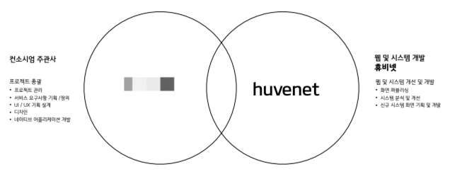
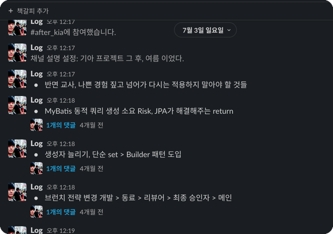

# KN.log

- 주니어 개발자의 우당탕탕 `KN` Project 수행기

---
## KN Project?

옛날 옛날에 `KN` 이라는 지구 어딘가의 자동차 관련 회사가 있었음.

`Huvenet`은 해당 회사의 프로젝트를 진행하게 되었는데,

해당 프로젝트의 개요는 아래와 같음.

### 프로젝트 개요

- `KN`의 기존 렌터카 시스템(`MiPlatform`)의 고도화
  - **기존 Legacy 버그 수정, 신규 요건 개발**
- `KN` 신규 **대고객 사이트 런칭**
- 영업소 계약, 관리용도 **영업용 테블릿 사이트 런칭**
- 신규 대고객, 영업용 테블릿 서버 관리 용도 **관리자 사이트 런칭**


### 프로젝트 기간

- 개발 기간
  - 총합 : 13개월, 395일
    - 고도화 프로젝트 3.0
      - 2022.10.01 ~ 2022.02.14
    - 대고객, 영업용 테블릿, 관리자 IA 사이트 오픈
      - 2022.02.15 ~ 2022.10.03
    - 대고객, 영업용 테블릿, 관리자 IA 사이트 안정화
      - 2022.10.04 ~ 2022.10.31
  - 투입 인력 : 6 명
- 유지보수 기간
  - 총합 : 2개월, 61일
    - 2022.11.01 ~ 2022.12.31
  - 투입 인력 : 3 명
    - 2개월 2 명
    - 1개월 1 명

### 프로젝트 분량
  - 화면설계서
    - 총합 : 798 P
      - 대고객 : 394P
      - 영업용 테블릿 : 176P
      - 관리자 : 122P
      - 마이플랫폼 : 106P
  - 버그리포트
    - 총합 : 999 건
      - 개발 Ver 이슈 : 825 건
      - 운영 Ver 이슈 : 174 건
  - 기타 산출물
    ```
    1. 기아차 RFP
        - 기아렌터카시스템고도화_RFP_20210802_V1.6.pptx
    2. 제안서
        - 0825_기아렌터카 고도화 프로젝트 제안서1.7_appknot.pdf
    3. 산출물 리스트
        - 기아렌트카 프로젝트 산출물 목록 정리_210930_v3.xlsx
    4. 요건정의 취합(전체) ★
        - 요건 정의 취합본_210514_검토중.pptx
        - 요건 분석 정리_210802.xlsx
    5. (현)계약서 양식 ★
        - 4.28단기-자동차임대차계약서.pdf
        - 4.28장기-자동차임대차계약서.pdf
    6. 기아차 렌터카사업부 담당자 업무분장표
        - ★업무분장 현황(2021.9.1일 기준)___.xlsx___.xlsx)
    7. 기아차 렌터카 지점 업무처리 지침
        - 개정후)렌터카사업)1.렌터카 지점 업무처리 지침_최종.pptx렌터카사업)1.렌터카_지점_업무처리_지침_최종.pptx)
    8. 완성차 전자계약 프로세스
        - 임대차 전자계약 프로세스 (201125) .pptx_.pptx)
    9. 장기/단기 렌터카 시스템 요건정의 ★
        - (장기)계약서 렌터카시스템 요건정의 201221.pptx계약서_렌터카시스템_요건정의_201221.pptx)
        - (단기)계약서 렌터카시스템 요건정의20210118.pptx계약서_렌터카시스템_요건정의20210118.pptx)
    10. 기아차 렌터카사업부 중고차 업무 ★
        - 렌터카시스템 중고차 셀 업무 21.10.05 정연석cm 作.pptx
    11. 기아차 렌터카사업부 수금(채권) 업무 요건 정리 ★
        - 가상계좌 자동입금처리 개발요건정의.pptx
        - 기아포인트 개발지원 요건 정의.pptx
        - 대량 거래처 관리 화면 개발요건정의.pptx
        - 세금계산서 자동전송 개발요건정의.pptx
        - 장기Table변경(SLM0050) 화면 개선요건정의.pptx_화면_개선요건정의.pptx)
    12. 기아차 렌터카사업부 차량등록, 개소세 등 업무 요건 정리 ★
        - 담당자별 업무 정의(이상엽).pptx.pptx)
    13. 현대차 전자계약서 플랫폼(e-sign) 관련 자료 ★★★
        - eSign API 가이드-v1.0_210917.pdf
        - eSign 사용자 안내서_일반사용자용_v0.94_210903_ko.pdf
        - [eSign] 법인 공동 전자서명 연동 및 설계_v1.0_20211101.pptx
        - 장기-자동차임대차계약서(22.9.16)_전자계약생성용.pdf
    14. WBS 및 산출물 관리
        - 기아렌터카_WBS_v0.6_211022.xlsx
        - 기아렌터카_프로젝트산출물_v0.0.5_211022.xlsx
        - 기아렌터카_고도화프로젝트_테이블정의서.xls
        - Huvenet_APPVERSION_API_Reference.pdf
        - RENTA2_DDL.sql
        - kia_rent_3.0_source_admin_business_customer.zip
    15. 파일명명규칙
        - 기아렌터카_명칭정의및파일명규칙_v1.0.0_211101.pdf
    16. 장기렌트 프로세스 흐름도
        - 전자결재프로세스흐름도 211103.pptx
    17. 기아렌터카 관리시스템(마이플랫폼) 사용자 가이드 (참고용)
        - 신용카드관리-사용자설명서-일반사용자190411.pptx
    18. 렌터카 전자계약 연계 방안 회의록
        - 211021 전자계약서 회의록.docx
        - 2021-11-04 회의록
        - 20211104 전자게약 2차회의 현차 인원 렌터카인원 전원.docx
        - 전자결재프로세스흐름도 211103 (1).pptx.pptx)
    19. 기아렌터카 고객센터 FAQ
        - 기아렌터카 고객센터 상담LIST(최종).xlsx.xlsx)
    20. 블루월넛 API
        - Bluewalnut_Lite_ForJSP_빌링결제_v1.14.zip
        - 기아차_렌터카시스템_연동_인터페이스명세서_V1.00_보안해제.xls
    21. 기아 렌터카 시스템 IA
        - 기아렌터카_IA_영업용태블릿_211108_v1.0.0.xlsx
        - 기아렌터카_IA_대고객서비스_v1.3.3_220414.xlsx
    22. 인터뷰 준비_밸류랩스
        - Admin_인터뷰_준비_211109.zip
    23. 담당자별 인터뷰 시 보여준 자료 모음
        - ★ 2021 렌터카사업팀 사업계획 명의변경 프로세스 개선 (210422)_이진아매니저(11월 9일자 인터뷰).pptx_이진아매니저(11월_9일자_인터뷰).pptx)
        - 반납 프로세스Ⅲ.pptx
        - totalzip_렌터카시스템 오류 건 4번째_1635824685.703187.zip
        - totalzip_렌터카시스템 오류 건 1번째_1635824418.639206.zip
        - totalzip_렌터카시스템 오류 건 2번째_1635824493.673180.zip
        - totalzip_렌터카시스템 오류 건 3번째_1635824582.688022.zip
    24. 요구사항 ID 정의서
        - 기아렌터카_요구사항정의서_v1.4.0_211206.xlsx
    25. WBS
        - 기아렌터카_WBS_v1.1.11_220214_휴비넷업데이트.xlsx
    26. 연동 API 관련 문서
        - svn_설치_가이드_리눅스용_.pdf
        - Tibero_6_Installation_Guide_v2.1.7.5.pdf
        - tibero6-bin-FS07_CS_2005-linux64-186930-opt-tested.tar.gz
        - JEUS_7_Web_Admin_Guide.pdf
        - 전자문서등록_서비스_가이드v1.0.pdf
        - PJTD_빌링결제(빌키)_연동매뉴얼_v1.14.pdf
        - eformsign 임베딩 가이드_v1.0_220808.pdf
        - eSign 전자계약 서비스 플랫폼_DASH_API설계서_v1.2_220120 (1).xlsx
        - 기아차_렌터카시스템_연동_인터페이스명세서_V1.00_보안해제 (2).xls
        - ccspApi (1).zip
        - 통합계정 API (1).pdf
        - eSign 사용자 안내서_일반사용자용_v0.94_210903_ko (1).pdf
        - eSign API 가이드-v1.0_210917 (1).pdf
        - Bluewalnut_Lite_ForJSP_빌링결제_v1.14 (1).zip
        - ATA.tar
        - tibero_package.zip
        - 가이드 문서.zip
        - fido_java_Sample.zip
    27. 대고객 화면 설계서
        - 기아렌터카_화면설계서_대고객서비스_v1.1.1_220408.pptx
        - 기아렌터카_화면설계서_대고객서비스_v1.0.3_220322.pptx
        - 기아렌터카_화면설계서_대고객서비스_v1.2.0_220414.pptx
        - 기아렌터카_화면설계서_대고객서비스_v1.3.0_220608.pptx
        - 기아렌터카_화면설계서_대고객서비스_v1.3.2_220621.pdf
        - 기아렌터카_화면설계서_대고객서비스_v1.4.7_220930.pdf
    28. 관리자 웹 화면 설계서
        - 기아렌터카_화면설계서_관리자웹_v1.0.6_220408.pptx
        - 기아렌터카_화면설계서_관리자웹_v1.1.1_220413.pptx
        - 기아렌터카_화면설계서_관리자(웹)_v1.1.4_220518.pptx_v1.1.4_220518.pptx
        - 기아렌터카_화면설계서_관리자(웹)_v1.1.7_220714.pptx.pptx_v1.1.7_220714.pptx
    29. 관리자 웹 마이플랫폼 화면 설계서
        - 기아렌터카_화면설계서_관리자웹_마이플랫폼_v0.0.1_220414.pptx
        - 기아렌터카_화면설계서_관리자(마이플랫폼)_v0.0.2_220426.pptx_v0.0.2_220426.pptx
        - 기아렌터카_화면설계서_관리자(마이플랫폼)_v0.0.4_220509.pptx_v0.0.4_220509.pptx
        - 기아렌터카_화면설계서_관리자(마이플랫폼)_v0.0.6_220610.pptx_v0.0.6_220610.pptx
        - 기아렌터카_화면설계서_관리자(마이플랫폼)_v0.0.9_220704.pptx_v0.0.9_220704.pptx
        - 기아렌터카_화면설계서_관리자(마이플랫폼)_v0.1.2_220714.pptx.pptx_v0.1.2_220714.pptx
        - 기아렌터카_화면설계서_관리자(마이플랫폼)_v0.1.3_220718.pptx_v0.1.3_220718.pptx
        - 기아렌터카_화면설계서_관리자(마이플랫폼)_v0.1.4_220719.pptx_v0.1.4_220719.pptx
    30. 영업용 테블릿 화면설계서
        - 기아렌터카_화면설계서_영업용태블릿_v1.1.8_220607.pptx
        - 기아렌터카_화면설계서_영업용태블릿_v1.1.12_220721.pdf
        - 기아렌터카_화면설계서_영업용태블릿_v1.2.9_220930.pdf
    31. 알림톡 정의서
        - 기아렌터카_알림톡_v1.2.8_221017.xlsx
        - 템플릿 정의(규칙) 22.09.06.xlsx_22.09.06.xlsx
    32. CMS 자동납부 신청서 양식
        - CMS 자동납부신청서.zip
    33. 화면설계서 공통정책
        - 기아렌터카_화면설계서_공통정책_v1.1.12_220831.pptx
    34. 차량 임대차 승계합의서 양식
        - 차량 임대차 승계합의서 양식.pptx
    35. 마이플랫폼 프로세스개선 화면설계서
        - 02_KIA렌터카_채권외주화프로세스개선_화면설계서_v1.3_220121 (1).pptx
        - 01_KIA렌터카_명의변경프로세스개선_화면설계서_v1.6_220216.pptx
    36. 프로세스 정의서
        - 기아렌터카_프로세스정의서_v1.1.6_220415.pptx
    37. 제플린 디자인(이미지)
        - 기아렌터카_고도화프로젝트_제플린_디자인_2022.10.25.zip
    38. 장기대여료(신대여료체계) 관련 수식
        - 신대여료체계정리_시뮬레이션_20220719.xlsx
    39. 마이플랫폼 개선, 신규 화면 개발진행현황 리스트
        - 마이플랫폼_개발진행현황리스트_20221025.xlsx
    40. 통합(현업)테스트 1차 진행목록
        - 220821_기아렌터카_현업테스트.pptx
        - 기아렌터카_현업테스트_진행목록_1차(18일)_220818.xlsx_220818.xlsx
        - 기아렌터카_현업테스트_진행목록_3차(22일)_220822.xlsx_220822.xlsx
        - 기아렌터카_현업테스트_진행목록_4차(23일)_220823.xlsx_220823.xlsx
    41. 기아렌터카 고도화 프로젝트 3.0 모의해킹
        - 20220926_대내외_신규_개편_2021C018_C0215_[렌터카 시스템 고도화 3.0]영업용태블릿 모의해킹 결과보고서(이행X)_v0r8m0 (1).pdf
        - [렌터카 시스템 고도화 3.0]렌터카Web 모의해킹 결과보고서 (1).pdf
        - 렌터카시스템고도화3.0_렌터카Web_모의해킹_조치사항보고서.docx
        - 렌터카시스템고도화3.0_영업용테블릿_이행조치내역_v1.1.docx
    42. 기아렌터카_버그리포트
        - 기아렌터카_버그리포트(취합용)_221026.xlsx_221026.xlsx)
    ```

### 프로젝트 수행 인력



- 기획, 디자인
  - 총합 : 6+명
    - `A??N???`
      - 이하 `AN`
      - `AN` 기획 컨소시엄 기획자 PM 1명
      - 기획자 2명
      - 디자인 ??명
    - `V????L???`
      - 이하 `VL`
      - `VL` 기획 컨소시엄 기획자 PM 1명
      - 기획자 1명
    - `Huvenet`
      - L
        - 개발사 기획자 PM

- 개발
  - 총합 : 7명
  - 년차 현황
    - PM : 1명
    - 3년차 : 1명
    - 2년차 : 2명
    - 1년차 : 3명
  - `Huvenet`
    - P
      - 개발사 대표
    - H
      - 3년차
    - L
      - 2년차
    - Hz
      - 2년차
    - J
      - 1년차
    - Je
      - 1년차
    - S
      - 1년차

---

## KN.log ?

- 395일간 진행했던 KN Project에서, <br> `T???O?` CTO 역할 겸임으로 인해 개발사 PM 인력 `P`의 공백이 발생.
    - _사실상 옆집 P 아저씨_


- Project를 수행하다보니 어느새 스무스하게 제가 개발사 PM 역할을 겸임 하게됨.
  - ?? 뭐하다 어케 하다보니 그렇게됨 ㅋㅋ


- 처음 겪어본 대규모 SI 프로젝트, 처음 수행해본 PM 역할이다보니 부족한 점, 느낀 점, 생각이 많았던 프로젝트 였음.
  - 개발 기간은 계속 딜레이되고, 갈등도 많았고, 매끄럽지 못했음 


- 다음으로 나아가기 위해선 지난날을 되돌아봐야 한다고 생각함.
  - 못한점 : 반면교사, 잘한점 : 이건 좋았다 ㄹㅇ ㅋㅋ


- `KN` Project를 수행하며 22.07.03일 부터 중간중간 생각나거나 생각한 내용들을 슬랙 채널에 러프하게 정리했었음.
  - 


- KN.log 에서는 러프하게 정리했던 내용들을 다시 다듬고, 프로젝트를 수행하며 느꼈던, 생각했던 점들을 공유하려함.


- KN.log의 목표는 누군가에 대한 질책, 누군가에 대한 칭찬, 해당 내용이 개발의 진리이니 따라라~ 하는 것이 아님
- _이거아님_


- 내가 그 당시 느꼇던 내 생각을 공유하며, 다른이들과 의견을 공유하기 위함임.

---

## 주의사항

- 새겨들어야할 내용들이 아닌 한 프로젝트를 겪은 개인의 생각임
- 아래 모든 내용은 개인적인 의견, 주장일 뿐 반박가능
- 발표자가 발표를 잘 못함, 중간에 이해 안되거나 의문이 들면 바로바로 얘기해줘야함
  - 뭔 얘기지??, 말하고자 하는바가 뭐지??, 뭔 헛소리지?? 등등...

---

## 목차

- [](#)

---


## 반면 교사, 나쁜 경험 짚고 넘어가 다시는 적용하지 말아야 할 것들


## MyBatis 동적 쿼리 생성 소요 Risk, JPA가 해결해주는 return

기존 1 페이지 1 API 문제점 제시

기아 화면 ID 엑셀 시트 예시
중복 코드 발생 예제 제시(렌트데스크)
신규 동적 API 방식 효과 제시
MyBatis 로 구현한 _sql 뚱뚱이 예시
JPA 로 하면 어케 바귀는지 Entity, 사용 메소드 제시
JPA 문제요소 가능한 팬텀, 더티, N+1,, EM, EF 객체 설정, Entity 생성 당시 설정 요소, QDSL 로 해결 가능 > 불안요소 미리 선빵


## 생성자 늘리기, 단순 set > Builder 패턴 도입
loginTest, loginWithCCSP 메소드 예시로 전환 가능 코드 예시


- 브런치 전략 변경 개발 > 동료 > 리뷰어 > 최종 승인자 > 메인
동료, 전파 효과//리뷰어 어쨋든 기존 코드 컨벤션 등 입장에서 1차로 함 // 최종 승인자가 보고서 받듯이 거기만 보면 되고 문제나 개선점 보이면 해당 리뷰 참여자들 다 같이 얘기나누며 병합


## 12주 법칙 << 

최소 12주, 나쁜습관도 12주 넘게 했는데 좋은 습관은 최소 12주는 있어야지


## 제도, 관습 차이,, 구성원의 필요성 인지<< 강제성 X 자율 참여가 핵심


## 짝 프로그래밍, 너 나와

, 1명이 요청하면 하던일 진짜 미친 중요도 아니면 멈추고 같이 해결하기
주에 1팀 느낌으로 랜덤으로 2명 묶어서 같은 업무 주기??


- 짝 프로그래밍 OJT 느낌으로 같이 하는 업무 하는것도 컨벤션에 도움 될거같음
너 나 와, 2인삼각 (편집됨) 
너 와 나
너 + 나 = 와!
A + B >>>> S


### ccsp login 관련 bad code 작성 남기고 loginTest 메소드 예제로 실제 뒤로 던진 결과 최종 수정시에 과정
(눈으로 보이는 작업량보여주기, 뒤로 던진 코드가 유지보수 시에 더 할일이 많아지는거)


### 쓰레기통 쓰레드 같은거나 채널 만들거나 레포지토리 만들어서 아무나 작업하다가 거기다가 이슈 던지고 회의떄 같이 얘기나누는거 좋을거같다
1명이 전체 코드 큰그림으로 안좋은거 찾는거보다 여러명이 작업하다가 보게되는 예전 코드, 구 프로젝트, 레거시에서 문제점 파악 가능


- 슈퍼맨 > 어벤져스 > 호크아이 슨배임


- API 생성시 상태 값, 응답 코드 정리 잘하자
나만 쓰는 API 만들때 응답 코드 메시지 같은거 그냥 생략하면 ~~~ 어쩌고인거임 하는거 자체도 로직


- 개발자 추정치는 틀릴 우려가 높다
콜백지옥, Dashboard, 실제 데이터, 테스트 데이터 , 개발 > 운영 데이터로 넘어가면

- 다트
API 개발 시 응답 값을 특정지을 수 있게 영점조절 최대한 정확하게 맞출 수 있도록 검색 조건을 신경써야 한다<< 이걸 제일 중요하게 API 만들때 생각해야 한다
콜백지옥을 부름
데이터양 많아지면 미친다


- url 계층 관계 API
/api/longRent?memberName=길선웅
/api/longRent/member?name=길선웅
back 단 입장에서 longRentService에는 member의 unique Id 가 있을 경우 반환 타입을 set 하는 로직 수정 X
member 단에서 검색조건을 활용하는 객체의 uniqueid를 longRent에 set할 수 있음
longRentController에 longRent dto로 받을 때 member의 검색조건에 사용될 dto의 컬럼을 계속 증강하는게 아닌, longRentMemberHandler에서는 MEmber 객체를 매개변수로 받을 수 있음
결국 코드 수정량 줄어듬


- 의도 전달이 참 어렵다

너가 언제 뭐 했잖아 왜 그렇게 안했어
연애에서 좋은 상대일까, 인간관계에서,좋은 사람 ?? X
업무에선 어떨까
문제 발견 > 이슈 제기 > 문제 해결
문제 발견 > 그냥 어휴 내가 하지 뭐 > 문제 발견 > 그냥 어휴 내가 하지 뭐 > 루프


- 이슈 중요도가 다르다.
개발자가 생각하는 중요도, 기획자가 생각하는 중요도, 사용자가 생각하는 중요도
이슈 중요도를 맞추는 방법

박관호 매니저님이 캘린더 기본 값 날짜를 40년대에 맞춰달라했는데
개발자는 어차피 대충 캘린더 옵션만 바꾸면 되지 나중에 급한거부터 하고 해줄게
개발자는 보이지도 않는 다른 DB단, 비즈니스 로직만 몰두
사용할 현업들은 불편함 계속 > 히잉.. 언제 해줘 느낌


- 무분별한 정보의 지속적 노출은 오히려 도움이 안된다.
TMI
특정 채널에 common.js 공통화 함수 추가, 변동사항 내역 계속 올림
채널 알람 꺼버림, 나중에 찾아보지도 않음, 중복코드 다량 발생

나중에 openKakaoMap 함수는 소스본에서 어떻게 사용되었을까

!- image

우리 개발 위키
우리도 하나 있으면 안됨?
!- image

Api 문서 까지?!


- 규약 잡는게 정말 중요하다.
규약 없이 시간이 경과, 작업물이 증가, 쌓여갈수록 되돌리기,, 문제 해결하기 어려워 진다
그게 소스 컨벤션이든, 개발 규약이든, 업무처리방식이든


- 수달과 솜사탕
진수성찬을 준비해 열심히 먹는사람에게 간들 그걸 엎어버리면 무슨 소용
좋은내용 좋은것 도 다 상대적개념
전달방식의 중요성


- 최적, 최선, 최고

- 성공적인 온보딩 지원이란


- 생산자와 소비자
-- 오마카세
--- 오마카세에 갔는데 화려한 손기술, 고급스런 장비, 싱싱한 재료 인들,
요리사한테 'ㅎㅎ 오늘 뭐가 맛있어요?' 물어 봤더니,
'다 맛있으니까 빨리 고르기나해요 개열받네' 하는 케이스

요리사한테 '이거 참치를 똥통에 빠뜨려서 바짝 타듯이 구워서 레어 상태로 주시겠어요?'
요리사 : '넹(뭐지 미친놈인가)'
요리 : (똥)
손님 : '으악 뭐야 이거'
요리사 : '? 니가 이렇게 해달라매요'

- 왼손 네번째 손가락을 걸고, 의도전달을 아무리 노력한들 다음날은 3가지 그 다음날은 5가지 , .... n개의 받아들인 내용이 존재한다

- 미안하다 1년전 길록아


- 개발자 전시회, 사이드프로젝트, 사이드프로젝트 서버, 성장 측정기 스카우터 사이트
- 내가한 성장 작성하고 성장치 그래프로 보여주는 사이트
- 노력이 어려운 이유는 가시적인 
- 무수히 요청을 보내도 pending되는게 아니라 빈 값을 response 해주니


- 인터페이스를 너무 쉽게 생각했나??
- -스파게티 코드, SRP, 비즈니스 로직 세분화 관련

## 카테고리화
- 알고있는 지식을 카테고링, 범주화 시키는게 중요하다.

## 티키타카
- 티키타카는 축구 용어 인데, 합 맞추면서 패스 하는게 더 공격적
- 원맨 체제 팀은 무너진다.
- 우리는 다른언어, 다른 경력, 다른 지식수준을 갖고 있다.
- 그 갭을 맞추는 화합이 필요,
  - 동양 그 태극기 가운데 같은 문양
- 지금까지 나는 내가 속한 프로젝트에서는 원맨이었다.
  - 다른 사람들 나이가 다들 몇살이신진 모르겠다. 나는 28살 남은 30년 개발자 인생 원맨일 자신도 능력도 없다.
  - 근데 티키타카 하면서 30년 개발자 인생 할 자신있다.

- Tiki
- 하루에 얼마나 많은 검색, 지식 정리, 공부 ? 각각 하는데
- 그게 공유가 안되니 버려지는 부분이 많지 않을까?
  - 킹크랩이나 돼지 도축같은 사진으로 버려지는 부위 많은거 사진

## 초년 출세
- 션이 22.10.19에 휴비넷 개발자들한테 강의 해준 내용중에 초년출세의 반대 그게 있었는데,
  - 인생의 3대불행
- 초년에 출세하는게 불행이다, 그럼 그 반대 초년에 실패하는게 인생의 행복이다.


### 1.01^365
- 실패도 어렵다, 성공도 어렵다고 생각
- 한번의 실패, 한번의 성공을 대하는 자세가 중요하다고 생각
- 잦은 실패, 잦은 성공이 성장 원동력
- 한 주제를 작게 잡고 작게 성공하고 작게 실패하는걸 반복하는게 중요하다 생각
  - low risk, low return으로 꾸준히 1.01^365
- 누적이 중요하다.
- 지금 우리가 잘하고 지금 못하고가 중요한게 아니다.
- 지금부터 우리가 잘할것이냐 못할것이냐가 중요
- 인생의 실패, 개발자로서의 실패 라는 큰 주제로 봣을때,
지금 절망감을 안고 있는 사람 인생에서 실패한거? 개발자로서 실패한거?
- 인생의 성공, 개발자로서의 성공이라는 큰 주제로 봣을때,
지금 성공감을 느끼는 사람은 인생에서 성공한거? 개발자로서 성공한거?

아니라고 생각
#### 오디세우스의 배
뭐가 오디세우스의 배일까?
뭐라고 얘깋

## 단단함과 유연함
단단하면서 유연할수는 없을 것 같다.
시니어는 단단해야하고, 주니어는 유연해야한다.
시니어는 정확해야하고, 주니어는 창의적이어야한다.
- 월드워 z 이스라엘 생존 부분


## 101마리 달마시안
100개의 버그
1개의 정말 중요한 버그

가려질수있다.

테스트, 버그의 양이 핵심이 아닌

중요한 버그를 찾는것이 핵심

테스트를 많이 하는 것은 중요한 버그를 찾기위한 방법이다

### 퀄리티 높은 테스트를 위해선?

테스트 하는 ADM 분들 있었는데,

많이 올려서 짜증났는데,

이게 개발자 탓임

로직을 몰라서 올리는 건들이 정말 많았는데,

로직 설명을 잘했다면 이사람들이 그렇게 올렸을까?.

## 피트 스탑, 우물안 개구리

피트스탑을 짧게,
업무, 관심 기술 스택, 한발짝 멀어져서 시야를 넓히기

휴가를 가고, 리프레시 하는것만이 피트스탑이 아님

코드보던 모니터에서 잠깐 멀어져 스트레칭 하는것도

가장 작은단위의 피트스탑

내가 아는 내용, 생각에서 잠시 멀어져

다른사람과 의견을 공유하는 것 역시 피트스탑

내가 생각하는 피트스탑, 잠시 멈추기

우물안 개구리가
자기 우물을 깊게 파면

우물 밖을 벗어나기 어렵다.
